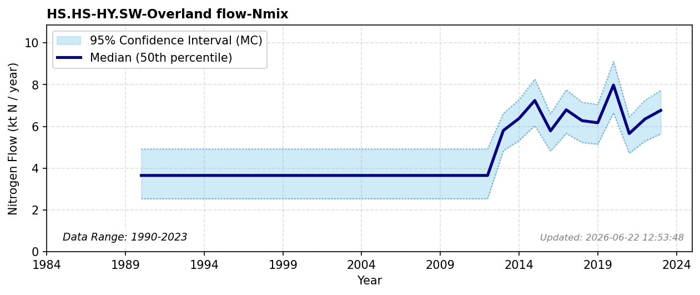

# Urban Overland Flow

### Flow Description
**HS.HS-HY.SW-Overland flow-Nmix** is a flow that has been added to account for runoff from urban areas. Some of this may actually end up directly in CW, but we have not been able to separate the two. Data are supplied by NIVA, produced in the TEOTIL3 model (Sample et al., 2024). For the period 1990-2013, we have used TEOTIL data (Sample, 2025) for nitrogen from urban areas that reach the coast, and used a retention rate of 5% which is consistent (with a 7% standard deviation) with the TEOTIL3 data from NIVA. The constant values for 1990-2012 is what is reported by Miljødirektoratet.

### References

* Sample, J. E. (2025). *Kildefordelte tilførsler av nitrogen og fosfor til norske kystområder i 2023 – tabeller, figurer og kart*.
* Sample, J. E., Jackson-Blake, L., Vogelsang, C., & Kaste, Ø. (2024). *TEOTIL3: En modell for beregning av kildebaserte tilførsler via elver og direktetilførsler til kyst*.
