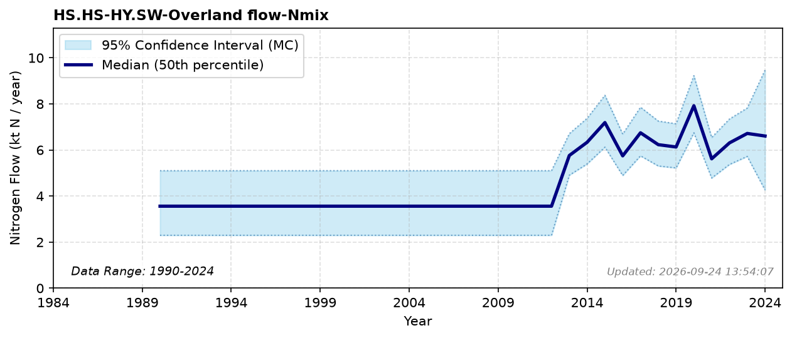

# Urban Overland Flow

### Flow Description
**HS.HS-HY.SW-Overland flow-Nmix** is a flow that has been added to account for runoff from urban (built-up) areas. Some of this may actually end up directly in CW, but we have not been able to separate the two. For 1990-2012, we use the 'Bebygd' (built-up area) column of the Miljødirektoratet compilation of coastal N loading by source (Sample, 2025). From 2013 onward, we switch to the 'urban' component of the TEOTIL3 model outputs from NIVA (Sample et al., 2024), which supersedes the Miljødirektoratet figures where the two overlap. In both periods, a retention fraction is applied to account for N retained before reaching surface water (5% most likely, ranging 0-20%, following TEOTIL3).

### References

* Sample, J. E. (2025). *Kildefordelte tilførsler av nitrogen og fosfor til norske kystområder i 2023 – tabeller, figurer og kart*.
* Sample, J. E., Jackson-Blake, L., Vogelsang, C., & Kaste, Ø. (2024). *TEOTIL3: En modell for beregning av kildebaserte tilførsler via elver og direktetilførsler til kyst*.
