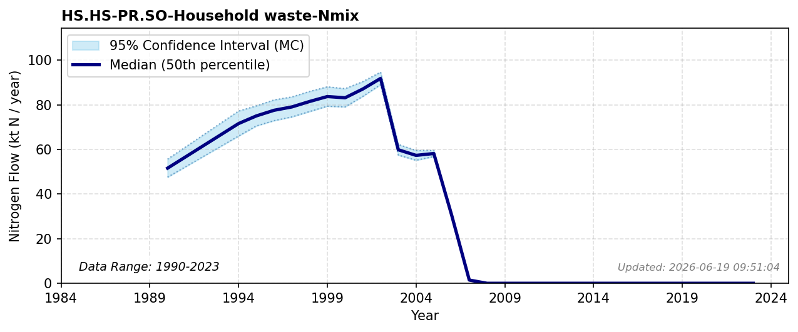

# Household and Settlement Waste

### Flow Description
**HS.HS-PR.SO-Household waste-Nmix** includes all types of solid waste from settlements which are processed in the sub-pool “solid waste” through incineration, landfilling, biofuel production or composting. We use data from SSB table 05282 “Avfallsregnskap for Norge (1 000 tonn), etter materialtype, statistikkvariabel, år og kilde” (1995-2011) and 10514 «Avfallsregnskap for Norge, etter kilde og materialtype (1 000 tonn) 2012 – 2023» with N contents taken from \Schäppi (2025) and typical, assumed values are chosen if none are given. We include households, services (tjenesteytende næringer), construction (Bygge- og anleggsvirksomhet), municipal services (power and water), and waste management.

Detailed data are not available prior to 1995, but trends in municipal and other waste are described by \ssb_avfall_1997 (n.d.). Household waste per inhabitant increased from about 200 kg/person to 289 kg/person in 1995 \\citep[figure 4.1]{ssb_avfall_1997}, with an assumed linear increase in the years between. Based on this we assume a constant N content per unit mass and extrapolate from 1995 values back to 1990.

### References

* Schäppi (2025). *Annexes to the {Guidance} {Document} on {NNB*.
* Missing reference data for key: `ssb_avfall_1997`
