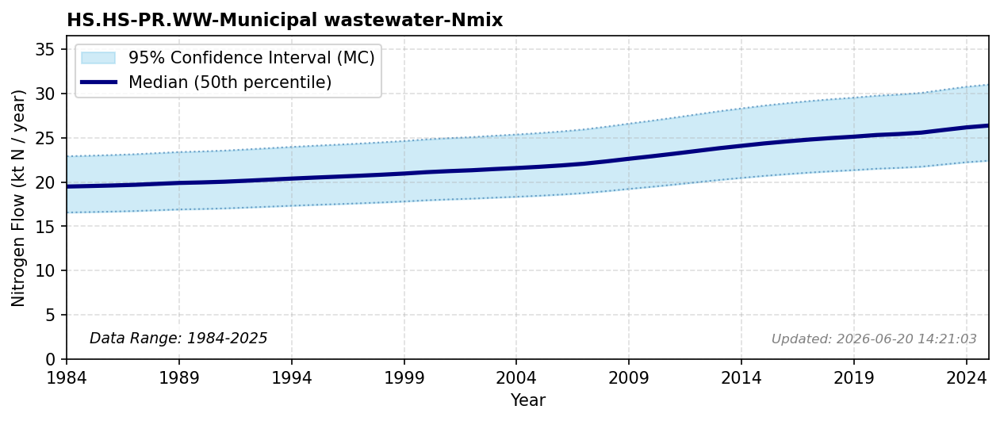

# Municipal Wastewater

### Flow Description
**HS.HS-PR.WW-Municipal wastewater-Nmix** are based on population data from SSB and assuming an average value of 4.65 kg N / person / year for municipal wastewater as advised by \\citet{schappi_annexes_2025}. This corresponds to 12.7 g N / person / day.

### References

* Schäppi (2025). *Annexes to the {Guidance} {Document} on {NNB*.
