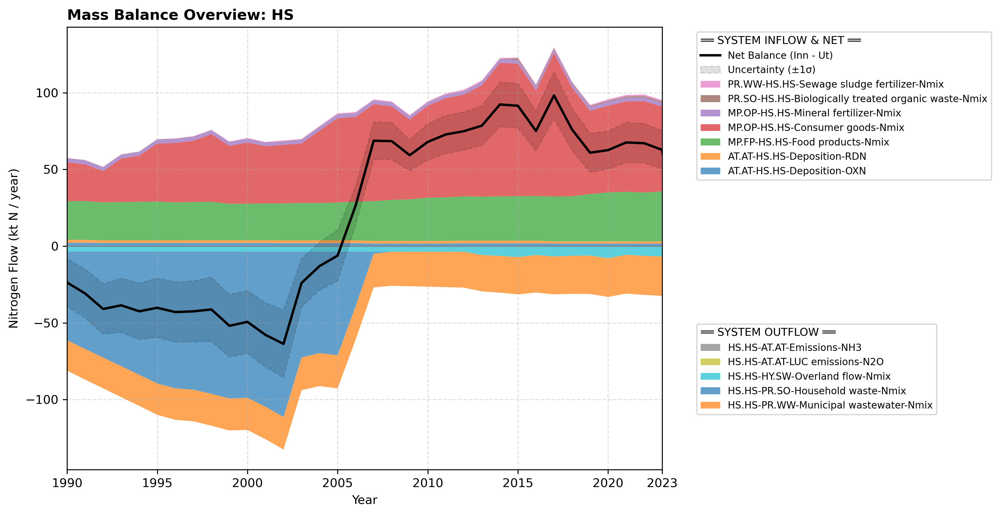

# Pool: Humans and settlements (HS)

---

## Mass Balance Overview (1990-2023)

The chart below illustrates the integrated nitrogen mass balance for **HS**. It includes total system inflows (positive stack), total outflows (negative stack), and the net balance line with estimated uncertainty bounds (±1σ).

### Flows that are zero or neglected:

* **HS.HS-AT.AT-LUC emissions-NH3** is assumed negligible as no NH3 emissions are given in the CLRTAP inventory submissions.
* **HS.HS-AT.AT-LUC emissions-NOx** is set to zero because none is reported in UNFCCC Common reporting tables, Table 4.
* **HS.HS-HY.SW-Untreated wastewater-Nmix** and **HS.HS-HY.CW-Untreated wastewater-Nmix** are set to zero because wastewater treatment is mandated by law.
* **HS.HS-PR.SO-Organic waste biofuel substrate-Nmix** and **HS.HS-PR.SO-Organic waste for composting-Nmix** are not given as separate flows; instead they are included in the flow **HS.HS-PR.SO-Household waste-Nmix** because official statistics do not clearly indicate what origin waste flows end up in different end uses.
* **HS.HS-MP.OP-Recycling-Nmix** is not reported here because the flow of wastes from all origins to recycling is assigned to the PR.OS subpool to better reflect the Norwegian waste management and statistics structure.

### References


