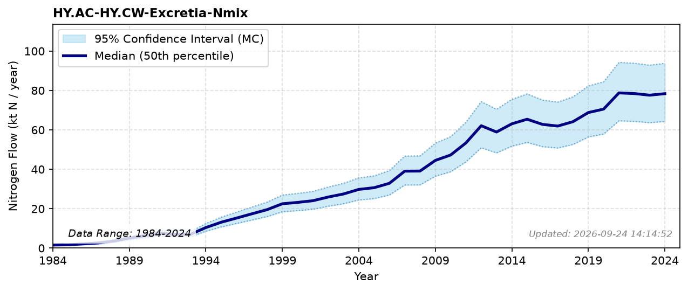

# Excretia

### Flow Description
Found through mass balance by assuming N that does not become fish or waste feed is excreted, using the same time-varying biological retention as the other aquafeed-budget flows (see the [methodological note](subpool_aquaculture.html) on the Aquaculture (HY.AC) subpool page for details and sources).

