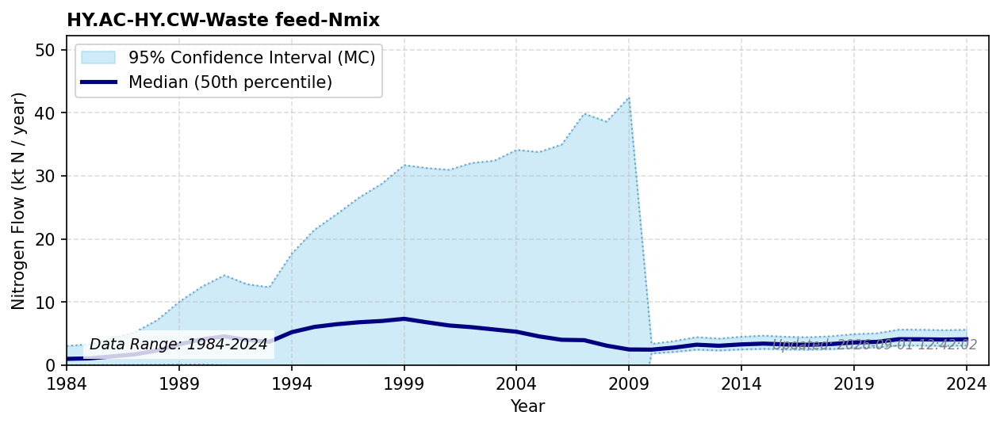

# Waste feed

### Flow Description
Calculated using data from Fiskeridirektoratet (2025) on sold farmed fish, using a feed-waste fraction estimated to fall from ~29% in 1990 to the measured 3% (Wang et al., 2013) by 2010 (see the [methodological note](subpool_aquaculture.html) on the Aquaculture (HY.AC) subpool page for how this is derived from the apparent whole-fish retention trend) and 2.8 % nitrogen content in fish and shellfish (Schäppi et al. (2025), p. 254).

### References

* Fiskeridirektoratet (2025). *A.06.002 Matfisk. Salg av laks, regnbueørret og ørret, etter art (Fylke) (1994-2024)*. [https://statistikkbanken.fiskeridir.no/PxWeb/pxweb/no/Fiskeridirektoratet/Fiskeridirektoratet__A%20Akvakultur__A.06%20Salg/A06002.px/](https://statistikkbanken.fiskeridir.no/PxWeb/pxweb/no/Fiskeridirektoratet/Fiskeridirektoratet__A%20Akvakultur__A.06%20Salg/A06002.px/)
* Schäppi, B., Reutimann, J., Bogler, S., & Ehrler, A. (2025). *Detailed Annexes to ECE/EB.AIR/119 – “Guidance document on national nitrogen budgets*. [https://www.clrtap-tfrn.org/sites/default/files/2025-05/Annexes%20to%20the%20Guidance%20Document%20on%20NNB.pdf](https://www.clrtap-tfrn.org/sites/default/files/2025-05/Annexes%20to%20the%20Guidance%20Document%20on%20NNB.pdf)
* Wang, X., Andresen, K., Handå, A., Jensen, B., Reitan, K., & Olsen, Y. (2013). Chemical composition and release rate of waste discharge from an Atlantic salmon farm with an evaluation of IMTA feasibility. *Aquaculture Environment Interactions, 4*(2), 147-162. [https://doi.org/10.3354/aei00079](https://doi.org/10.3354/aei00079)
