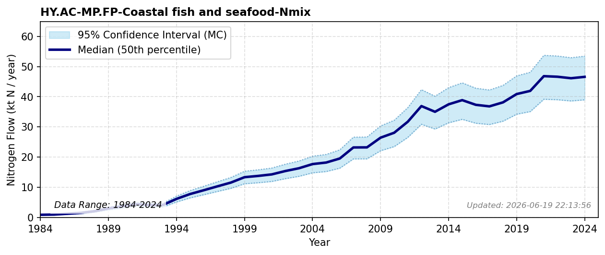

# Aquaculture production

### Flow Description
Calculated using data from Fiskeridirektoratet (2025) on sold farmed fish, assuming average

### References

* Fiskeridirektoratet (2025). *A.06.002 {Matfisk}. {Salg} av laks, regnbueørret og ørret, etter art ({Fylke}) (1994-2024)*. [https://statistikkbanken.fiskeridir.no/PxWeb/pxweb/no/Fiskeridirektoratet/Fiskeridirektoratet__A%20Akvakultur__A.06%20Salg/A06002.px/](https://statistikkbanken.fiskeridir.no/PxWeb/pxweb/no/Fiskeridirektoratet/Fiskeridirektoratet__A%20Akvakultur__A.06%20Salg/A06002.px/)
