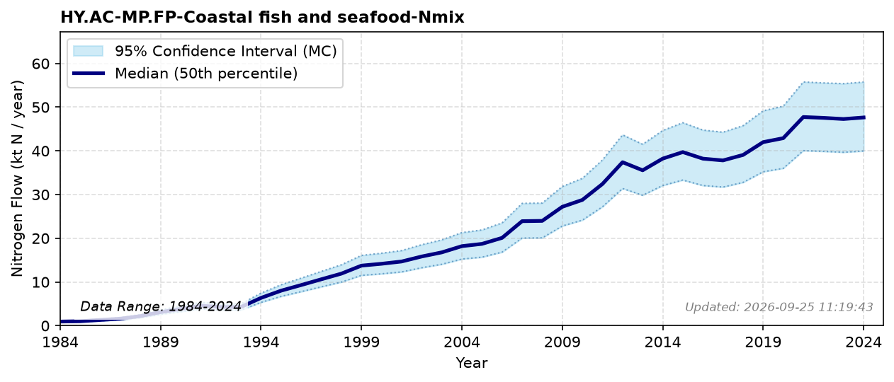

# Aquaculture production

### Flow Description
Calculated using data from Fiskeridirektoratet (2025) on sold farmed fish (extended back to 1984 using a historical compilation), assuming 2.8 % nitrogen content in fish and shellfish (Schäppi et al. (2025), p. 254).

### References

* Fiskeridirektoratet (2025). *A.06.002 Matfisk. Salg av laks, regnbueørret og ørret, etter art (Fylke) (1994-2024)*. [https://statistikkbanken.fiskeridir.no/PxWeb/pxweb/no/Fiskeridirektoratet/Fiskeridirektoratet__A%20Akvakultur__A.06%20Salg/A06002.px/](https://statistikkbanken.fiskeridir.no/PxWeb/pxweb/no/Fiskeridirektoratet/Fiskeridirektoratet__A%20Akvakultur__A.06%20Salg/A06002.px/)
* Schäppi, B., Reutimann, J., Bogler, S., & Ehrler, A. (2025). *Detailed Annexes to ECE/EB.AIR/119 – “Guidance document on national nitrogen budgets*. [https://www.clrtap-tfrn.org/sites/default/files/2025-05/Annexes%20to%20the%20Guidance%20Document%20on%20NNB.pdf](https://www.clrtap-tfrn.org/sites/default/files/2025-05/Annexes%20to%20the%20Guidance%20Document%20on%20NNB.pdf)
