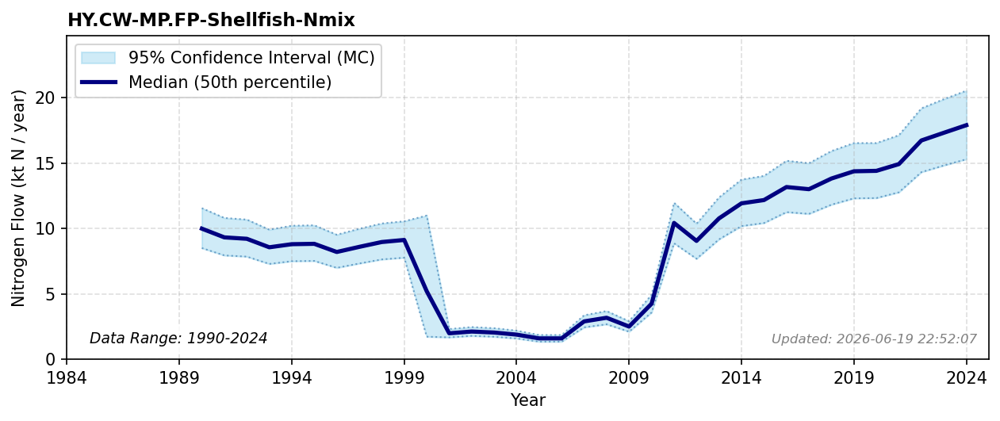

# Shellfish

### Flow Description
We use data from Fiskeridirektoratet (2025) on total wild fish catch. According to Schäppi et al. (2025), p254: N content in fish and shellfish: 2.8% according to UNECE Guidance, Annex 6 Table 12.

### References

* Fiskeridirektoratet (2025). *Fangst fordelt på art (offisiell statistikk)*. [https://www.fiskeridir.no/statistikk-tall-og-analyse/data-og-statistikk-om-yrkesfiske/fangst/fangst-fordelt-pa-art-offisiell-statistikk](https://www.fiskeridir.no/statistikk-tall-og-analyse/data-og-statistikk-om-yrkesfiske/fangst/fangst-fordelt-pa-art-offisiell-statistikk)
* Schäppi, B., Reutimann, J., Bogler, S., & Ehrler, A. (2025). *Detailed Annexes to ECE/EB.AIR/119 – “Guidance document on national nitrogen budgets*. [https://www.clrtap-tfrn.org/sites/default/files/2025-05/Annexes%20to%20the%20Guidance%20Document%20on%20NNB.pdf](https://www.clrtap-tfrn.org/sites/default/files/2025-05/Annexes%20to%20the%20Guidance%20Document%20on%20NNB.pdf)
