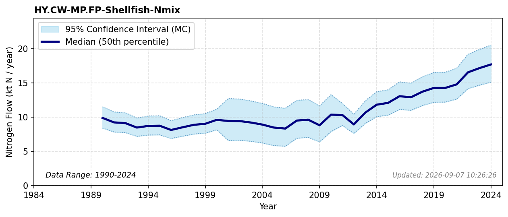

# Shellfish

### Flow Description
This flow combines shellfish/crustacean catch (2.8% N content, according to Schäppi et al. (2025), p254, UNECE Guidance Annex 6 Table 12) and wild-harvested macroalgae/seaweed (4% N content, Schäppi et al. (2025), table 21), both from Fiskeridirektoratet (2025). For 1990-2000, both components are taken from a historical compilation; from 2001 onward we switch to the modern source for shellfish. The modern source has no macroalgae figures before 2011, so for 2001-2010 the seaweed component is linearly interpolated between the last historical figure (2000) and the first modern one (2011).

### References

* Fiskeridirektoratet (2025). *Fangst fordelt på art (offisiell statistikk)*. [https://www.fiskeridir.no/statistikk-tall-og-analyse/data-og-statistikk-om-yrkesfiske/fangst/fangst-fordelt-pa-art-offisiell-statistikk](https://www.fiskeridir.no/statistikk-tall-og-analyse/data-og-statistikk-om-yrkesfiske/fangst/fangst-fordelt-pa-art-offisiell-statistikk)
* Schäppi, B., Reutimann, J., Bogler, S., & Ehrler, A. (2025). *Detailed Annexes to ECE/EB.AIR/119 – “Guidance document on national nitrogen budgets*. [https://www.clrtap-tfrn.org/sites/default/files/2025-05/Annexes%20to%20the%20Guidance%20Document%20on%20NNB.pdf](https://www.clrtap-tfrn.org/sites/default/files/2025-05/Annexes%20to%20the%20Guidance%20Document%20on%20NNB.pdf)
