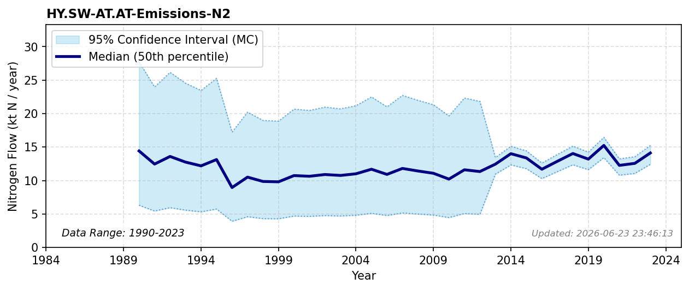

# N2 emissions from denitrification in surface waters

### Flow Description
N2 is taken from data on N retention in surface waters supplied by NIVA, produced in the TEOTIL3 model Sample et al. (2024), by assuming that all N retained in SW is lost to denitrification, with an assumed fraction 1 % as N2O and the rest as N2. For years prior to 2013, we have used a retention rate of 7 % which is the typical value from the NIVA data and calculated the denitrification amount as 0.07/(1-0.07)* **HY.SW-HY.CW-Inflow to coastal waters-Nmix**.

### References

* Sample, J. E., Jackson-Blake, L., Vogelsang, C., & Kaste, Ø. (2024). *TEOTIL3: En modell for beregning av kildebaserte tilførsler via elver og direktetilførsler til kyst*.
