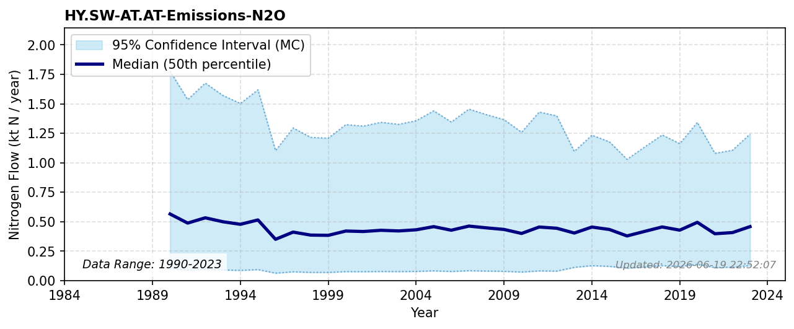

# Surface water N2O emissions

### Flow Description
Uses data on N retention in surface waters supplied by NIVA, produced in the TEOTIL3 model Sample et al. (2024), and assuming that all N retained in SW is lost to denitrification, with an assumed fraction 1 % as N2O and the rest as N2.

### References

* Sample, J. E., Jackson-Blake, L., Vogelsang, C., & Kaste, Ø. (2024). *TEOTIL3}: {En} modell for beregning av kildebaserte tilførsler via elver og direktetilførsler til kyst*.
