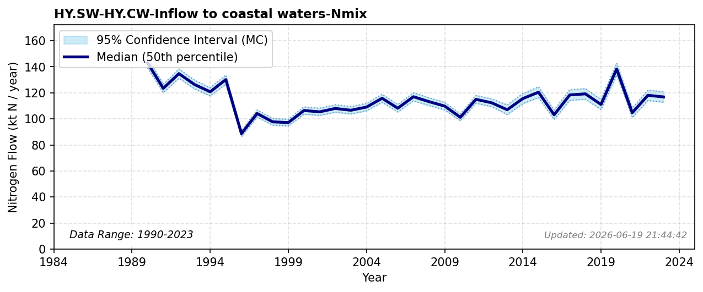

# Inflow to coastal waters

### Flow Description
Found from data supplied by NIVA, produced in the TEOTIL3 model Sample et al. (2024). Before 2013 we have

### References

* Sample, J. E., Jackson-Blake, L., Vogelsang, C., & Kaste, Ø. (2024). *TEOTIL3}: {En} modell for beregning av kildebaserte tilførsler via elver og direktetilførsler til kyst*.
