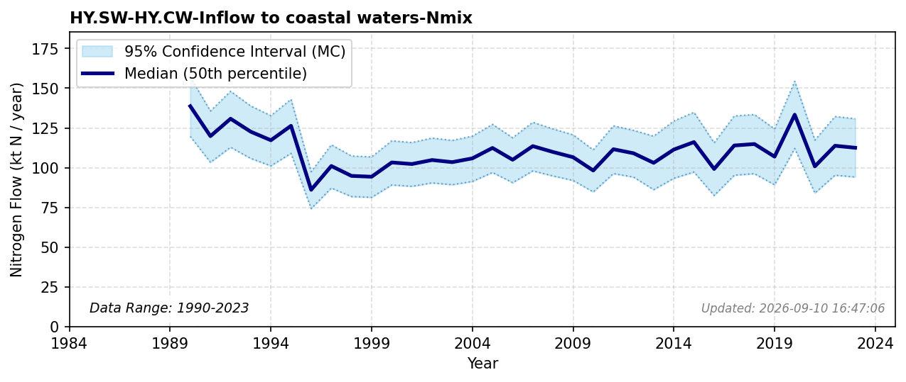

# Inflow to coastal waters

### Flow Description
Found from data supplied by NIVA, produced in the TEOTIL3 model Sample et al. (2024), from 2013 onward. TEOTIL3's total N-to-coast figure includes both aquaculture and treated wastewater discharge, so to avoid double counting with the dedicated aquaculture and wastewater flows, we subtract TEOTIL3's aquaculture component and the flow *PR.WW-HY.CW-Treated wastewater discharge-Nmix* (which already assigns all treated wastewater discharge to CW). Before 2013, we use values from table 7.2 in Sample (2025), which is already broken down by source category, so only the background, built-up area, industry and agriculture columns are summed - aquaculture and sewage are excluded directly rather than subtracted.

### References

* Sample, J. E. (2025). *Kildefordelte tilførsler av nitrogen og fosfor til norske kystområder i 2023 – tabeller, figurer og kart*.
* Sample, J. E., Jackson-Blake, L., Vogelsang, C., & Kaste, Ø. (2024). *TEOTIL3: En modell for beregning av kildebaserte tilførsler via elver og direktetilførsler til kyst*.
