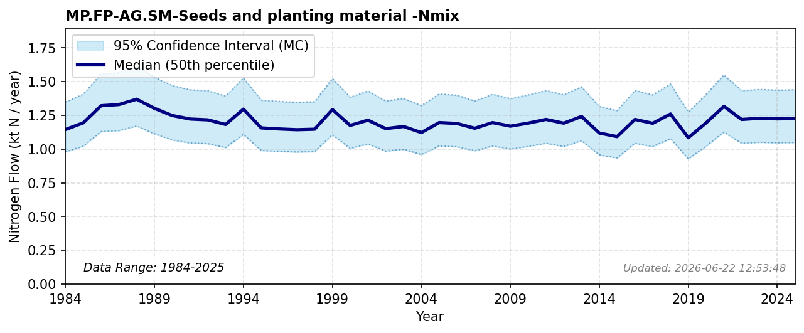

# Seeds and Planting Material

### Flow Description
**MP.FP-AG.SM-Seeds and planting material-Nmix** is taken from Gross nutrient balance in the Eurostat database as advised by Schäppi et al. (2025). There is data missing from 2017 to 2019; because there is a large reported increase between 2016 and 2020, we assume a constant increase in the missing time period and fill in data from this interpolation.

### References

* Schäppi, B., Reutimann, J., Bogler, S., & Ehrler, A. (2025). *Detailed Annexes to ECE/EB.AIR/119 – “Guidance document on national nitrogen budgets*. [https://www.clrtap-tfrn.org/sites/default/files/2025-05/Annexes%20to%20the%20Guidance%20Document%20on%20NNB.pdf](https://www.clrtap-tfrn.org/sites/default/files/2025-05/Annexes%20to%20the%20Guidance%20Document%20on%20NNB.pdf)
