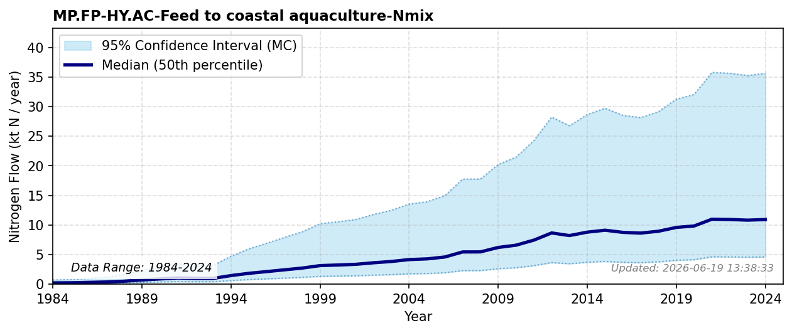

# Feed to Coastal Aquaculture

### Flow Description
**MP.FP-HY.AC-Feed to coastal aquaculture-Nmix**: the amount of feed per ton of produced fish is found by assuming an average protein (N) retention of 35.37 % based on values from Aas et al. (2022). The amount of produced fish is found by using data from Fiskeridirektoratet (Fiskeridirektoratet, 2025) on sold farmed fish.
\nHohmann-Marriott (2025) found the nitrogen content in aquaculture feed in 2020 to be 124 ktN, which is very similar to our results.

### References

* Aas, T. S., Åsgård, T., & Ytrestøyl, T. (2022). Utilization of feed resources in the production of {Atlantic} salmon ({Salmo} salar) in {Norway}: {An} update for 2020. *Aquaculture Reports, 26*, 101316. https://doi.org/10.1016/j.aqrep.2022.101316
* Fiskeridirektoratet (2025). *A.06.002 {Matfisk}. {Salg} av laks, regnbueørret og ørret, etter art ({Fylke}) (1994-2024)*. https://statistikkbanken.fiskeridir.no/PxWeb/pxweb/no/Fiskeridirektoratet/Fiskeridirektoratet__A%20Akvakultur__A.06%20Salg/A06002.px/
* Hohmann-Marriott, M. F. (2025). A Nitrogen budget for Norway analysis of Nitrogen flows from societal and natural sources (1961–2020). *PLOS ONE, 20*(2), e0313598. https://doi.org/10.1371/journal.pone.0313598
