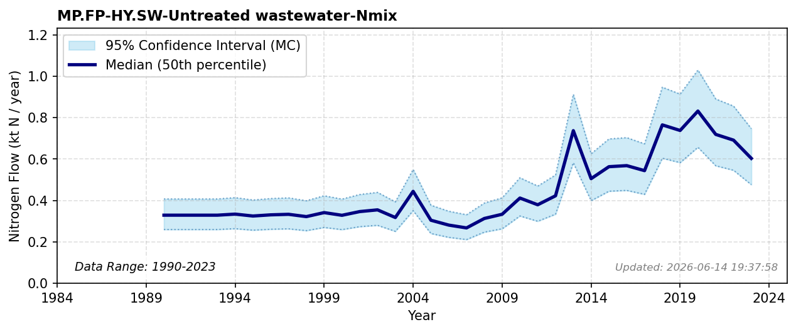

# Untreated Wastewater (Food Industry)

### Flow Description
**MP.FP-HY.SW-Untreated wastewater-Nmix** is found using data from Miljødirektoratet (personal communication, 2026) on emissions to water from individual industries, where industries are categorized as belonging to OP or FP, and their connection status to the municipal wastewater, based on the information given in the statistic. If no information on connection status was given we have assigned the values to Untreated wastewater. The database does not distinguish between emissions to surface and coastal waters, so even though several large industries discharge their wastewater to the coast, we assign this entire flow to SW in order to avoid double counting.
\nThe values reported before for 1989-1992 are significantly lower than for later years. We therefore extrapolate back to 1990 using the mean value for 1994-1998.

