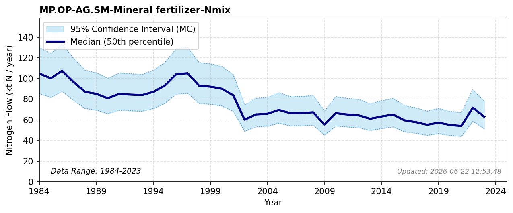

# Produced Mineral Fertilizer

### Flow Description
**MP.OP-AG.SM-Mineral fertilizer-Nmix** is domestically produced mineral fertilizer used in agriculture, found as (total domestic use) – (import), where both use and import are given in FAOSTAT Fertilizer by nutrient (FAO, 2025).

### References

* FAO (2025). *Fertilizer by nutrient*. [https://www.fao.org/faostat/en/#data/RFN](https://www.fao.org/faostat/en/#data/RFN)
