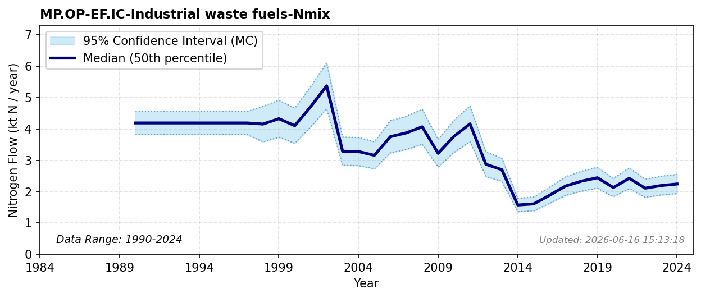

# Industrial Waste Fuels

### Flow Description
**MP.OP-EF.IC-Industrial waste fuels-Nmix** is wood waste used as biofuel in the industries where the waste originates, reported as "egentilvirket bioenergi" in the SSB statistic (table 08205). Producers of wood and paper products obtain a significant fraction of their energy through this source. “Egentilvirket bioenergi” encompasses “black liquor” as well as wood waste. For lack of better compositional details we have assumed values for the entire flow corresponding to wood, although this brings significant uncertainty.\n\nThe net caloric value of 15.6 for conversion is taken from table 1.2 in Garg et al. (2006) and we assume a mean N content of 4.0 kg/t (between coniferous and non-coniferous wood; see FS.FO-MP.OP-Industrial round wood-Nmix).
\nSSB has not reported data on this energy category before 1998, but the size of these industries was relatively constant through the period 1991-2001 (Spilde & Aasestad, 2004). For years 1990-1997 we have therefore used the average for the next 10 years (1998-2007).

### References

* Garg, A., Kazunari, K., & Pulles, T. (2006). Chapter 1. {Introduction. *IPCC} {Guidelines} for {National} {Greenhouse} {Gas} {Inventories*. https://www.ipcc-nggip.iges.or.jp/public/2006gl/pdf/2_Volume2/V2_1_Ch1_Introduction.pdf
* Spilde, D. & Aasestad, K. (2004). Energibruk i norsk industri: 1991 - 2001. *Statistisk Sentralbyrå*(2004,3).
