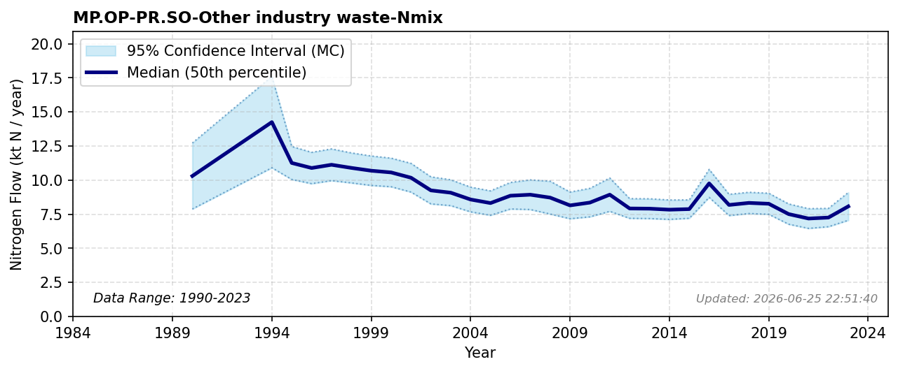

# Other Industry Waste

### Flow Description
**MP.OP-PR.SO-Other industry waste-Nmix**: we use data from SSB table 05282 “Avfallsregnskap for Norge (1 000 tonn), etter materialtype, statistikkvariabel, år og kilde” (1995-2011) and 10514 «Avfallsregnskap for Norge, etter kilde og materialtype (1 000 tonn) 2012 – 2023» with N contents taken from Schäppi et al. (2025) and typical, assumed values are chosen if none are given. The statistic does not separate between food and other industry waste. We make the assumption that everything in the category “wet organic waste” is from the food industry, and all other waste is assigned to other producing industry. Here we also include all waste from “other industries” (annen eller uspesifisert næring). The category “contaminated waste” is very irregularly reported (placed in different sectors in different years) and has therefore been excluded.

There is a change in categorization between the two tables, where the main difference is in the category “other waste” and “mixed waste”. To ensure continuity between the data series we chose a lower value for “other waste” than for “mixed waste”. Values between 1990 and 1994 are extrapolated from 1995 given the change in industry waste reported between 1992 and 1995 reported by SSB (1997).

### References

* Schäppi, B., Reutimann, J., Bogler, S., & Ehrler, A. (2025). *Detailed Annexes to ECE/EB.AIR/119 – “Guidance document on national nitrogen budgets*. https://www.clrtap-tfrn.org/sites/default/files/2025-05/Annexes%20to%20the%20Guidance%20Document%20on%20NNB.pdf
* SSB (1997). *Naturressurser og miljø 1997*.
