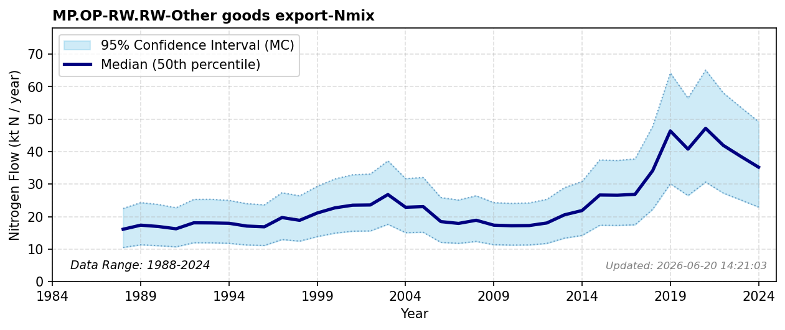

# Other Goods Export

### Flow Description
**MP.OP-RW.RW-Other goods export-Nmix** is taken from SSB trade data (table 08801) on goods that can be characterized as flowers, chemicals, soap, industrial protein, leather, wood and textiles. 

