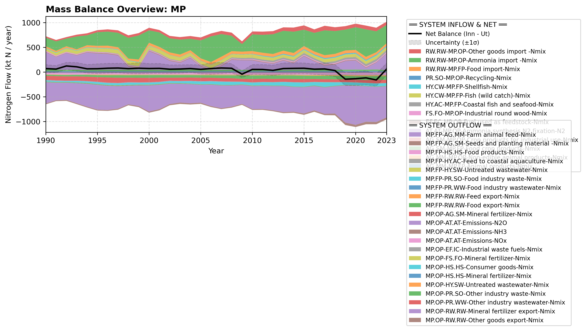

# Pool: Materials and products in industry (MP)

This pool covers chemical, processing, food, and manufacturing industries in Norway, split into two primary segments:

* [Food and Feed Processing (MP.FP)](subpool_food_and_feed.html)
* [Other Producing Industry (MP.OP)](subpool_other_industry.html)

---

## Mass Balance Overview (1990-2023)

The chart below illustrates the integrated nitrogen mass balance for **MP**. It includes total system inflows (positive stack), total outflows (negative stack), and the net balance line with estimated uncertainty bounds (±1σ).

