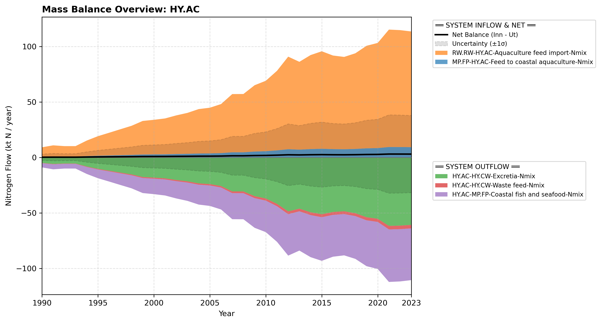

# Subpool: Aquaculture (HY.AC)

---

## Mass Balance Overview (1990-2023)

The chart below illustrates the integrated nitrogen mass balance for **HY.AC**. It includes total system inflows (positive stack), total outflows (negative stack), and the net balance line with estimated uncertainty bounds (±1σ).

### Flows that are zero or neglected:

* **HY.AC-MP.FP-Freshwater fish and seafood-Nmix**, **HY.AC-HY.SW-Waste feed-Nmix** and **HY.AC-HY.SW-Excretia-Nmix** are set to zero...
* **HY.AC-AT.AT-Emissions-NH3** is set to zero assuming negligible ammonia emissions from these coastal marine cages.
