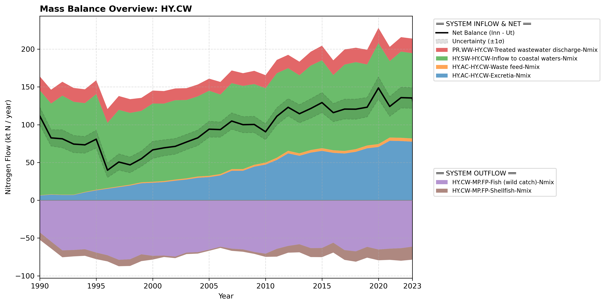

# Subpool: Coastal water (HY.CW)

---

## Mass Balance Overview (1990-2023)

The chart below illustrates the integrated nitrogen mass balance for **HY.CW**. It includes total system inflows (positive stack), total outflows (negative stack), and the net balance line with estimated uncertainty bounds (±1σ).

### Flows that are zero or neglected:

* **HY.CW-AT.AT-Emissions-N2** is neglected as we do not use mass balance on this subpool.
* **HY.CW-AT.AT-Emissions-N2O** and **HY.CW-AT.AT-Emissions-NOx** are neglected as we lack a clearly defined area for coastal waters.
* **HY.CW-PR.SO-Biomass for energy production-Nmix** is neglected because organic material from the processing of caught or farmed fish is assigned to the MP.FS subpool...
* **Recreational fishing** is not included in the official guidelines, and we have also chosen to neglect it here...

### References


