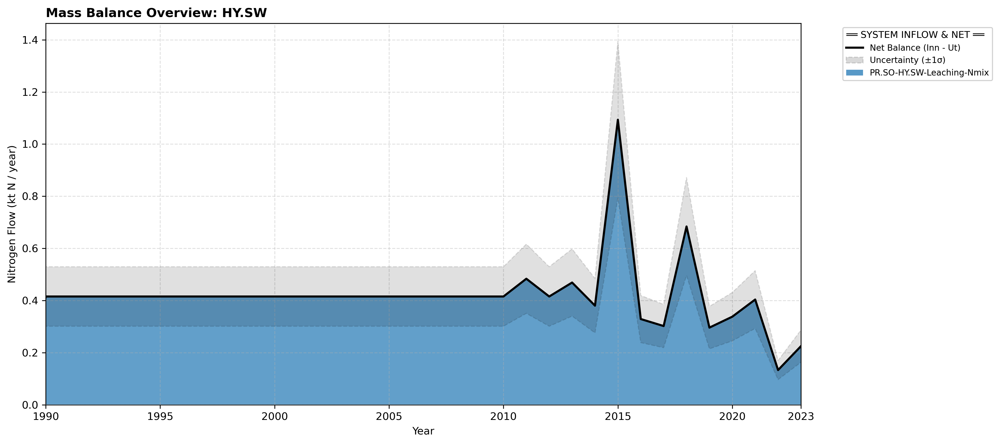

# Subpool: Surface water (HY.SW)

---

## Mass Balance Overview (1990-2023)

The chart below illustrates the integrated nitrogen mass balance for **HY.SW**. It includes total system inflows (positive stack), total outflows (negative stack), and the net balance line with estimated uncertainty bounds (±1σ).

### Flows that are zero or neglected:

* **HY.SW-AT.AT-Emissions-NOx** is assumed negligible.
* **HY.SW-RW.RW-Export of surface water-Nmix** is assumed negligible due to Norwegian topography.
