# Pool: Atmosphere (AT) — Outgoing Flows

This section documents all nitrogen flows leaving the atmosphere pool, including biological nitrogen fixation, industrial synthesis, atmospheric deposition, and atmospheric boundary outflows, as simulated in `at_mc.py`.

---

## Table of Contents
* [AT AT AG SM Biological N2 fixation N2](#at-at-ag-sm-biological n2 fixation-n2)
* [AT AT AG SM Deposition OXN](#at-at-ag-sm-deposition-oxn)
* [AT AT AG SM Deposition RDN](#at-at-ag-sm-deposition-rdn)
* [AT AT FS FO Deposition OXN](#at-at-fs-fo-deposition-oxn)
* [AT AT FS FO Deposition RDN](#at-at-fs-fo-deposition-rdn)
* [AT AT FS FO N2 fixation N2](#at-at-fs-fo-n2 fixation-n2)
* [AT AT FS OL Deposition OXN](#at-at-fs-ol-deposition-oxn)
* [AT AT FS OL Deposition RDN](#at-at-fs-ol-deposition-rdn)
* [AT AT FS OL N2 fixation N2](#at-at-fs-ol-n2 fixation-n2)
* [AT AT HS HS Deposition OXN](#at-at-hs-hs-deposition-oxn)
* [AT AT HS HS Deposition RDN](#at-at-hs-hs-deposition-rdn)
* [AT AT HY SW Deposition OXN](#at-at-hy-sw-deposition-oxn)
* [AT AT HY SW Deposition RDN](#at-at-hy-sw-deposition-rdn)
* [AT AT HY SW N2 fixation N2](#at-at-hy-sw-n2 fixation-n2)
* [AT AT MP OP Ammonia synthesis N2 fixation N2](#at-at-mp-op-ammonia synthesis n2 fixation-n2)
* [AT AT RW RW Atmospheric outflow OXN](#at-at-rw-rw-atmospheric outflow-oxn)
* [AT AT RW RW Atmospheric outflow RDN](#at-at-rw-rw-atmospheric outflow-rdn)

---

## Outflow Documentation

## AT AT AG SM Biological N2 fixation N2

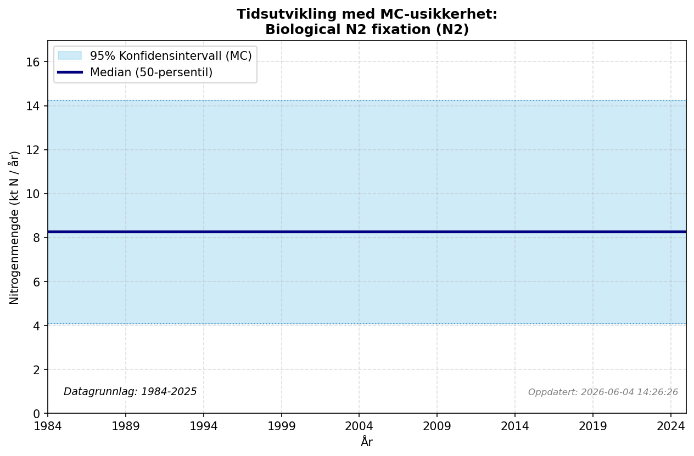

### Flow Description
**AT.AT-AG.SM-Biological N2 fixation-N2**

[^Schäppi2025] advises using data from the EUROSTAT Gross nutrient balance, but there is an error in this dataset for Norway which is currently being corrected (as of February 2026; personal correspondence, EUROSTAT). According to the EUROSTAT metadata, the BNF in this statistic is calculated based on the area of leguminous crops and fixation coefficients. The production of leguminous crops (peas, beans etc) in Norway is very low and we assume that agricultural BNF for the most part determined by leguminous crops such as clover grown on pastures and in fodder production.

(Bleken & Bakken, 1997) based their estimate for BNF from the sale of clover seeds: a sale of about 145 t seeds was estimated to be used to plant 95 000 ha of grass/clover mixtures (655 ha/t seeds). Together with a rate of BNF of 80 kgN/ha on this area, they found a total of 7.6 ktN per year and summed up to 8 ktN to account for BNF from free-living organisms and other sources. The rate of 80 kgN/ha agrees relatively well with later studies of agricultural BNF in Norway, where average values between 10 and 100 kgN/ha have been found; the highest values in particularly productive areas were up to 260 kgN/ha. Yearly statistics of clover seed sales are not available, but according to NIBIO Totalkalkylen [^NIBIO2025b], the area where grass/clover mixes may be sown for pasture and fodder production (fulldyrka eng) has remained constant to within about 3 % from 1995 up to today. Our best estimate for BNF, and for consistency with the previous study, is therefore to assume a constant value of 8 ktN/year. In Sweden [^Moldan2025] the value was found to be 34 kT in 2015, which is more in line with the values found before 2000.

---

## AT AT AG SM Deposition OXN

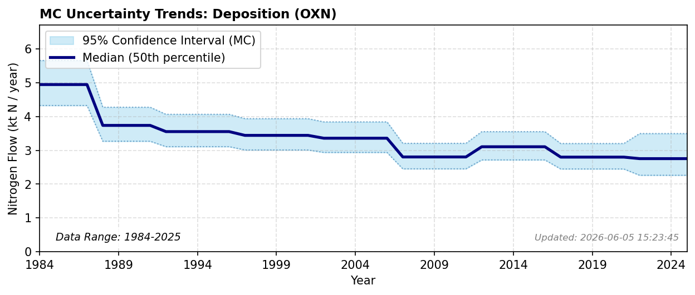

### Flow Description
**AT.AT-AG.SM-Deposition-OXN**

Atmospheric deposition was calculated using data from NILU which gives gridded deposition data for both oxidized and reduced N as averages for periods 1983-1987, 1988-1992, 1997-2001, 2002-2006, 2007-2011 and 2012-2016. For 2017-2021 we use total NILU data for that period and scale with the distribution across land classes for the previous period. Values after 2021 are extrapolated. To find deposition on different land categories we use the map resource AR5 from NIBIO [^NIBIO2016]. We find the total value of atmospheric deposition to the Norwegian mainland is, as given by NILU, 142 ktN in 2012-2016.

As noted, our value for agricultural soils is much larger than given by FAOSTAT. Hohmann-Marriott (2025) used values from Blake et al. (2023) to arrive at an average N deposition rate of 80.85 ktN for the period 2017-2021. Hohmann-Marriott (2025) also reported values of 74.7 and 33.5 ktN per year using two different methods for estimating biome-dependent N deposition rates.

---

## AT AT AG SM Deposition RDN

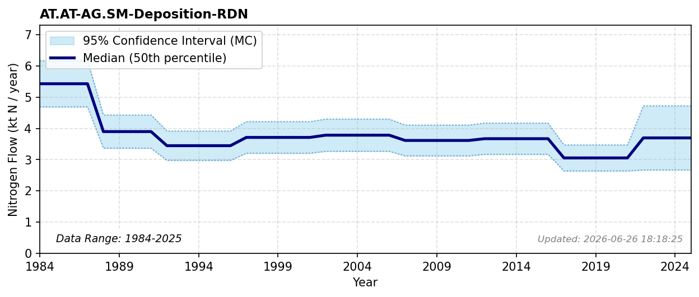

### Flow Description
**AT.AT-AG.SM-Deposition-RDN**

Atmospheric deposition was calculated using data from NILU which gives gridded deposition data for both oxidized and reduced N as averages for periods 1983-1987, 1988-1992, 1997-2001, 2002-2006, 2007-2011 and 2012-2016. For 2017-2021 we use total NILU data for that period and scale with the distribution across land classes for the previous period. Values after 2021 are extrapolated. To find deposition on different land categories we use the map resource AR5 from NIBIO [^NIBIO2016]. We find the total value of atmospheric deposition to the Norwegian mainland is, as given by NILU, 142 ktN in 2012-2016.

As noted, our value for agricultural soils is much larger than given by FAOSTAT. Hohmann-Marriott (2025) used values from Blake et al. (2023) to arrive at an average N deposition rate of 80.85 ktN for the period 2017-2021. Hohmann-Marriott (2025) also reported values of 74.7 and 33.5 ktN per year using two different methods for estimating biome-dependent N deposition rates.

---

## AT AT FS FO Deposition OXN

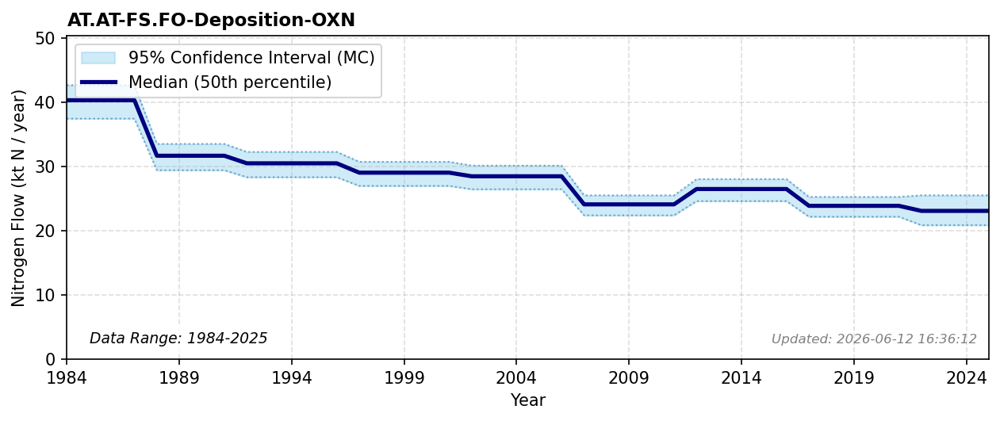

### Flow Description
**AT.AT-FS.FO-Deposition-OXN**

Atmospheric deposition was calculated using data from NILU which gives gridded deposition data for both oxidized and reduced N as averages for periods 1983-1987, 1988-1992, 1997-2001, 2002-2006, 2007-2011 and 2012-2016. For 2017-2021 we use total NILU data for that period and scale with the distribution across land classes for the previous period. Values after 2021 are extrapolated. To find deposition on different land categories we use the map resource AR5 from NIBIO [^NIBIO2016]. We find the total value of atmospheric deposition to the Norwegian mainland is, as given by NILU, 142 ktN in 2012-2016.

As noted, our value for agricultural soils is much larger than given by FAOSTAT. Hohmann-Marriott (2025) used values from Blake et al. (2023) to arrive at an average N deposition rate of 80.85 ktN for the period 2017-2021. Hohmann-Marriott (2025) also reported values of 74.7 and 33.5 ktN per year using two different methods for estimating biome-dependent N deposition rates.

---

## AT AT FS FO Deposition RDN

### Flow Description
**AT.AT-FS.FO-Deposition-RDN**

Atmospheric deposition was calculated using data from NILU which gives gridded deposition data for both oxidized and reduced N as averages for periods 1983-1987, 1988-1992, 1997-2001, 2002-2006, 2007-2011 and 2012-2016. For 2017-2021 we use total NILU data for that period and scale with the distribution across land classes for the previous period. Values after 2021 are extrapolated. To find deposition on different land categories we use the map resource AR5 from NIBIO [^NIBIO2016]. We find the total value of atmospheric deposition to the Norwegian mainland is, as given by NILU, 142 ktN in 2012-2016.

As noted, our value for agricultural soils is much larger than given by FAOSTAT. Hohmann-Marriott (2025) used values from Blake et al. (2023) to arrive at an average N deposition rate of 80.85 ktN for the period 2017-2021. Hohmann-Marriott (2025) also reported values of 74.7 and 33.5 ktN per year using two different methods for estimating biome-dependent N deposition rates.

---

## AT AT FS FO N2 fixation N2

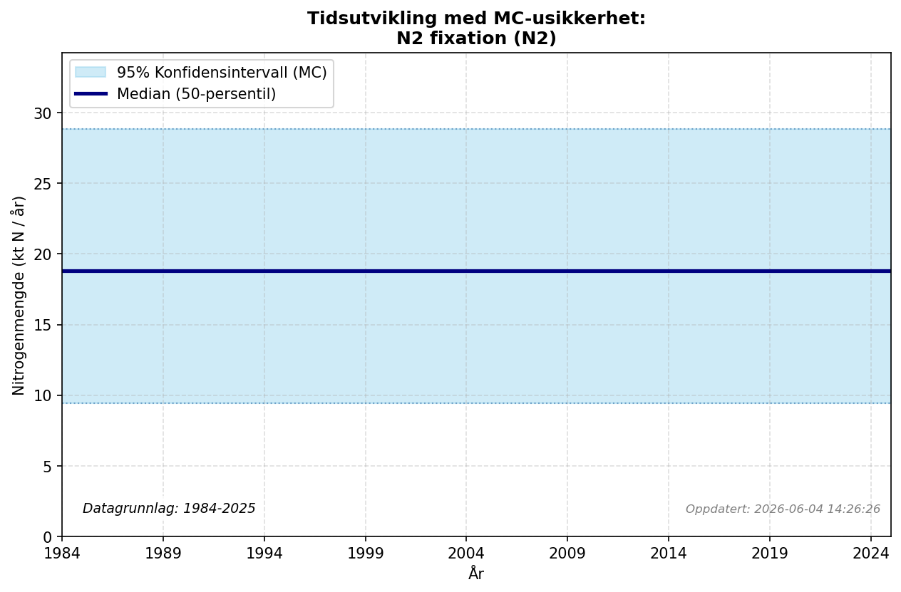

### Flow Description
**AT.AT-FS.FO-N2 fixation-N2**

Following the Swedish NBB [^Moldan2025], we use an N-fixation rate of 1.5 kg/ha/year and a forested area of 12.0 mill ha as given by SSB for 2019-2023 (table 14368); we assume this value is constant for our entire time period. This gives an annual N-fixation rate of 18.0 ktN. For comparison, the value for Sweden in 2015 was found to be 39.5 ktN [^Moldan2025].

---

## AT AT FS OL Deposition OXN

### Flow Description
**AT.AT-FS.OL-Deposition-OXN**

Atmospheric deposition was calculated using data from NILU which gives gridded deposition data for both oxidized and reduced N as averages for periods 1983-1987, 1988-1992, 1997-2001, 2002-2006, 2007-2011 and 2012-2016. For 2017-2021 we use total NILU data for that period and scale with the distribution across land classes for the previous period. Values after 2021 are extrapolated. To find deposition on different land categories we use the map resource AR5 from NIBIO [^NIBIO2016]. We find the total value of atmospheric deposition to the Norwegian mainland is, as given by NILU, 142 ktN in 2012-2016.

As noted, our value for agricultural soils is much larger than given by FAOSTAT. Hohmann-Marriott (2025) used values from Blake et al. (2023) to arrive at an average N deposition rate of 80.85 ktN for the period 2017-2021. Hohmann-Marriott (2025) also reported values of 74.7 and 33.5 ktN per year using two different methods for estimating biome-dependent N deposition rates.

---

## AT AT FS OL Deposition RDN

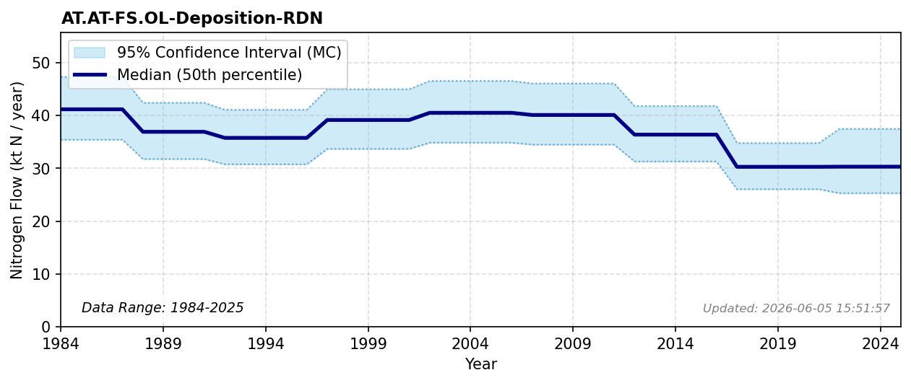

### Flow Description
**AT.AT-FS.OL-Deposition-RDN**

Atmospheric deposition was calculated using data from NILU which gives gridded deposition data for both oxidized and reduced N as averages for periods 1983-1987, 1988-1992, 1997-2001, 2002-2006, 2007-2011 and 2012-2016. For 2017-2021 we use total NILU data for that period and scale with the distribution across land classes for the previous period. Values after 2021 are extrapolated. To find deposition on different land categories we use the map resource AR5 from NIBIO [^NIBIO2016]. We find the total value of atmospheric deposition to the Norwegian mainland is, as given by NILU, 142 ktN in 2012-2016.

As noted, our value for agricultural soils is much larger than given by FAOSTAT. Hohmann-Marriott (2025) used values from Blake et al. (2023) to arrive at an average N deposition rate of 80.85 ktN for the period 2017-2021. Hohmann-Marriott (2025) also reported values of 74.7 and 33.5 ktN per year using two different methods for estimating biome-dependent N deposition rates.

---

## AT AT FS OL N2 fixation N2

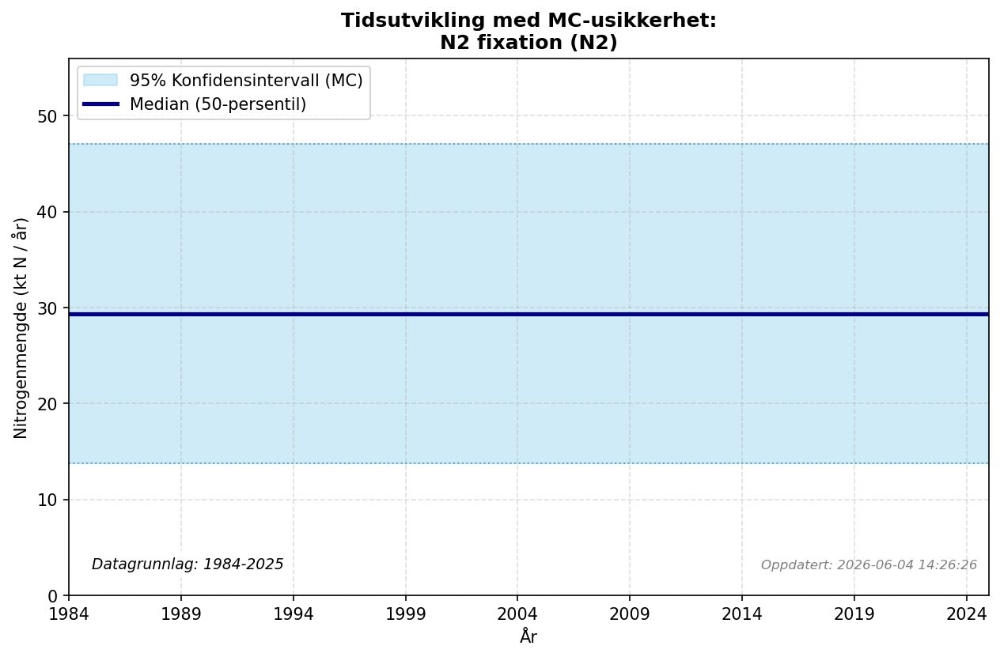

### Flow Description
*Atmospheric outflow plot detected. Filename: `AT_AT_FS_OL_N2 fixation_N2.png`.*

---

## AT AT HS HS Deposition OXN

### Flow Description
**AT.AT-HS.HS-Deposition-OXN**

Atmospheric deposition was calculated using data from NILU which gives gridded deposition data for both oxidized and reduced N as averages for periods 1983-1987, 1988-1992, 1997-2001, 2002-2006, 2007-2011 and 2012-2016. For 2017-2021 we use total NILU data for that period and scale with the distribution across land classes for the previous period. Values after 2021 are extrapolated. To find deposition on different land categories we use the map resource AR5 from NIBIO [^NIBIO2016]. We find the total value of atmospheric deposition to the Norwegian mainland is, as given by NILU, 142 ktN in 2012-2016.

As noted, our value for agricultural soils is much larger than given by FAOSTAT. Hohmann-Marriott (2025) used values from Blake et al. (2023) to arrive at an average N deposition rate of 80.85 ktN for the period 2017-2021. Hohmann-Marriott (2025) also reported values of 74.7 and 33.5 ktN per year using two different methods for estimating biome-dependent N deposition rates.

---

## AT AT HS HS Deposition RDN

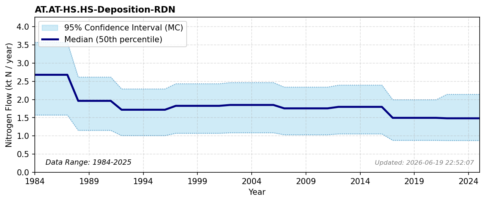

### Flow Description
**AT.AT-HS.HS-Deposition-RDN**

Atmospheric deposition was calculated using data from NILU which gives gridded deposition data for both oxidized and reduced N as averages for periods 1983-1987, 1988-1992, 1997-2001, 2002-2006, 2007-2011 and 2012-2016. For 2017-2021 we use total NILU data for that period and scale with the distribution across land classes for the previous period. Values after 2021 are extrapolated. To find deposition on different land categories we use the map resource AR5 from NIBIO [^NIBIO2016]. We find the total value of atmospheric deposition to the Norwegian mainland is, as given by NILU, 142 ktN in 2012-2016.

As noted, our value for agricultural soils is much larger than given by FAOSTAT. Hohmann-Marriott (2025) used values from Blake et al. (2023) to arrive at an average N deposition rate of 80.85 ktN for the period 2017-2021. Hohmann-Marriott (2025) also reported values of 74.7 and 33.5 ktN per year using two different methods for estimating biome-dependent N deposition rates.

---

## AT AT HY SW Deposition OXN

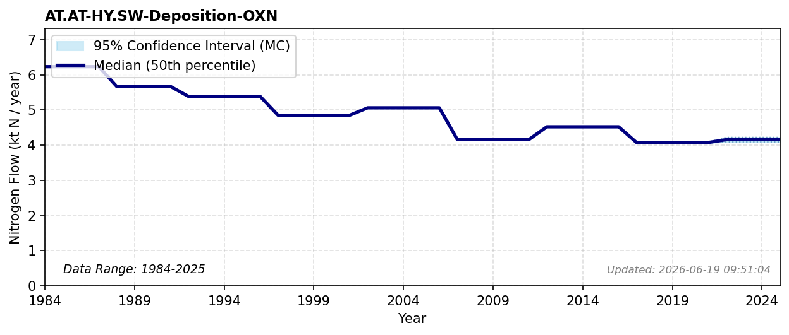

### Flow Description
**AT.AT-HY.SW-Deposition-OXN**

Atmospheric deposition was calculated using data from NILU which gives gridded deposition data for both oxidized and reduced N as averages for periods 1983-1987, 1988-1992, 1997-2001, 2002-2006, 2007-2011 and 2012-2016. For 2017-2021 we use total NILU data for that period and scale with the distribution across land classes for the previous period. Values after 2021 are extrapolated. To find deposition on different land categories we use the map resource AR5 from NIBIO [^NIBIO2016]. We find the total value of atmospheric deposition to the Norwegian mainland is, as given by NILU, 142 ktN in 2012-2016.

As noted, our value for agricultural soils is much larger than given by FAOSTAT. Hohmann-Marriott (2025) used values from Blake et al. (2023) to arrive at an average N deposition rate of 80.85 ktN for the period 2017-2021. Hohmann-Marriott (2025) also reported values of 74.7 and 33.5 ktN per year using two different methods for estimating biome-dependent N deposition rates.

For comparison, the data used in the TEOTIL model gives 3.5 ktN in 2013 and 3.0 ktN in 2023. These comparable but slightly lower values are the results of different datasets used and different data treatment.

---

## AT AT HY SW Deposition RDN

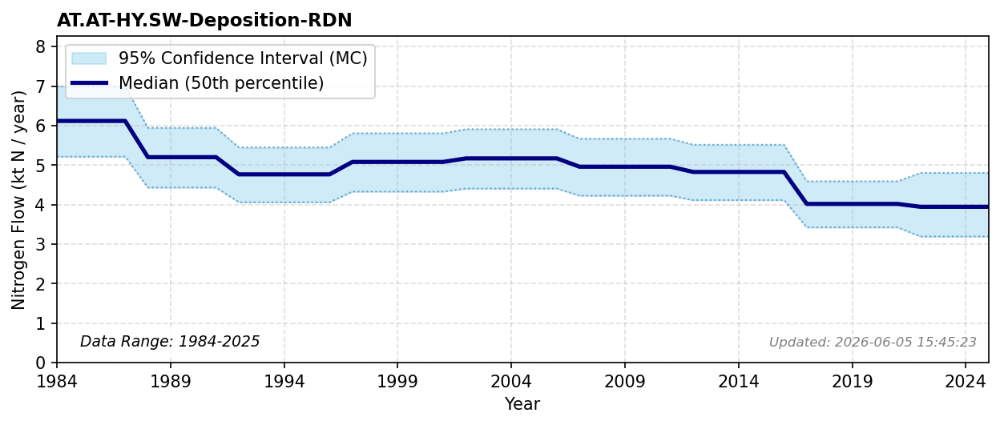

### Flow Description
**AT.AT-HY.SW-Deposition-RDN**

Atmospheric deposition was calculated using data from NILU which gives gridded deposition data for both oxidized and reduced N as averages for periods 1983-1987, 1988-1992, 1997-2001, 2002-2006, 2007-2011 and 2012-2016. For 2017-2021 we use total NILU data for that period and scale with the distribution across land classes for the previous period. Values after 2021 are extrapolated. To find deposition on different land categories we use the map resource AR5 from NIBIO [^NIBIO2016]. We find the total value of atmospheric deposition to the Norwegian mainland is, as given by NILU, 142 ktN in 2012-2016.

As noted, our value for agricultural soils is much larger than given by FAOSTAT. Hohmann-Marriott (2025) used values from Blake et al. (2023) to arrive at an average N deposition rate of 80.85 ktN for the period 2017-2021. Hohmann-Marriott (2025) also reported values of 74.7 and 33.5 ktN per year using two different methods for estimating biome-dependent N deposition rates.

---

## AT AT HY SW N2 fixation N2

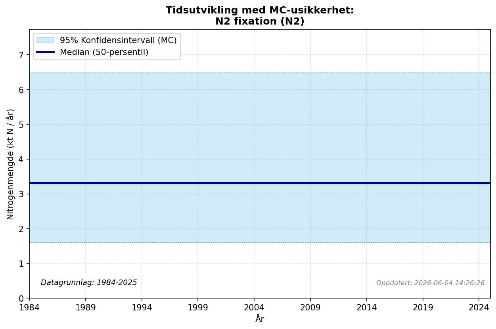

### Flow Description
**AT.AT-HY.SW-N2 fixation-N2**

According to NIBIO, the surface water area is 20 457 km2 (https://arealbarometer.nibio.no/nb/norge/). According to [^Schäppi2025], the biological fixation rate can vary between < 0.1 tN/km2 in oligotrophic and mesotrophic lakes to up to 10 tN/km2 in eutrophic lakes. Most lakes in Norway are not eutrophic and we use a low value of 0.1 tN/km2, which gives 2 ktN/year.

---

## AT AT MP OP Ammonia synthesis N2 fixation N2

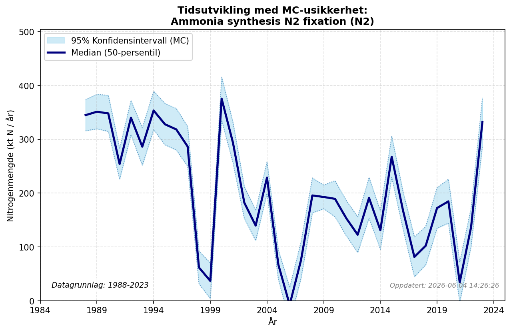

### Flow Description
**AT.AT-MP.OP-Ammonia synthesis N2 fixation-N2**

Is found through mass balance where we use data from FAOSTAT Fertilizer by nutrient, domestic fertilizer production, and subtracted the amount of ammonia imported from SSB trade data (table 08801). The result is a very variable curve which probably does not reflect year to year production well and could be a result of how trade statistics are reported.

---

## AT AT RW RW Atmospheric outflow OXN

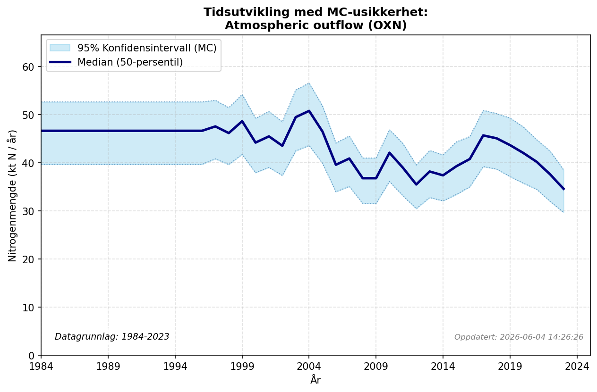

### Flow Description
**AT.AT-RW.RW-Atmospheric outflow-OXN**

Is found using source-receptor data from EMEP [^EMEP2024], as advised by [^Schäppi2025].

---

## AT AT RW RW Atmospheric outflow RDN

### Flow Description
**AT.AT-RW.RW-Atmospheric outflow-RDN**

Is found using source-receptor data from EMEP [^EMEP2024], as advised by [^Schäppi2025].

---

## References

*No reference file (referanser.bib) found.*
## References

*No reference file (referanser.bib) found.*
