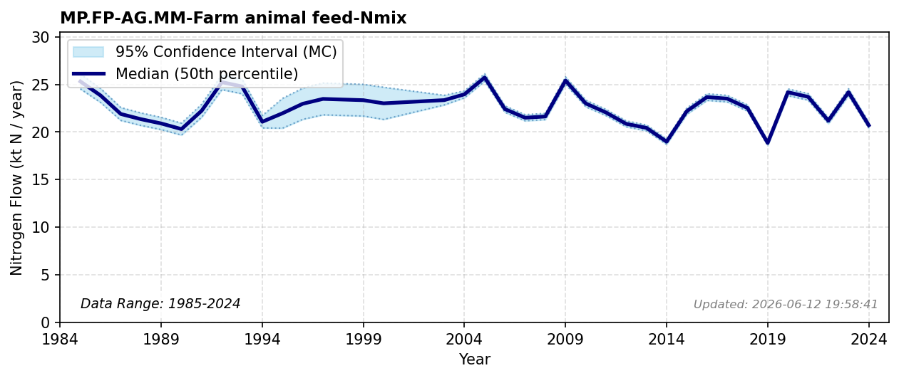

# Farm Animal Feed

### Flow Description
**MP.FP-AG.MM-Farm animal feed-Nmix** is feed to farm animals. We have used data on domestic feed supply from Landbruksdirektoratet (landbruksdirektoratet_matkorn_2025) and used the detailed composition of animal feed given in eidem_ruud_2022 (n.d.) together with protein contents from fao_feed_2021 (n.d.) and specific Jones factors from fao_jones_2023 (n.d.) to get nitrogen contents.\n\nBased on the Landbruksdirektoratet data, the N content of the total amount of feed is 0.02 kgN/kg feed. NIBIO Totalkalkylen gives statistics for total amount of feed to Norwegian farm animals between 1959 and 2026. Table 6.10 in bruholt_longva_1994 (n.d.) gives the domestically produced fraction of farm animal feed between 1985 and 1994. We combine these data to find values before 2000, using an average import fraction for 1995-1999.\n\nHohmann-Marriott (2025) found the domestic supply of animal feed in 2010 to be around 35 ktN, based on FAO statistics of production, export and import of seed cake, which is a dominant ingredient in farm animal feed. This is less than we found when combining domestic and imported animal feed. *(Note: This estimate might be too low, as it leads to a surplus here and a deficit in the AG.MM pool).*

### References

* Missing reference data for key: `bruholt_longva_1994`
* Missing reference data for key: `eidem_ruud_2022`
* Missing reference data for key: `fao_feed_2021`
* Missing reference data for key: `fao_jones_2023`
* Hohmann-Marriott, Martin F. (2025). *A Nitrogen budget for Norway analysis of Nitrogen flows from societal and natural sources (1961–2020)*. PLOS ONE. https://dx.plos.org/10.1371/journal.pone.0313598
* Missing reference data for key: `landbruksdirektoratet_matkorn_2025`
