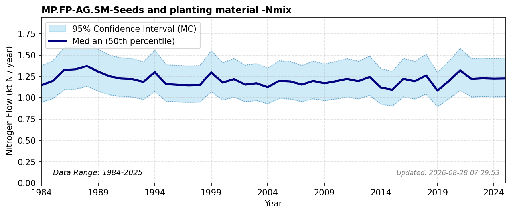

# Seeds and Planting Material

### Flow Description
**MP.FP-AG.SM-Seeds and planting material-Nmix** is purchased seed and planting material from NIBIO Totalkalkylen (cereal, oilseed, peas, grass seed, and root/vegetable seed), converted to N via protein content and crop-specific protein-to-N factors from Schäppi et al. (2025).

### References

* Schäppi, B., Reutimann, J., Bogler, S., & Ehrler, A. (2025). *Detailed Annexes to ECE/EB.AIR/119 – “Guidance document on national nitrogen budgets*. [https://www.clrtap-tfrn.org/sites/default/files/2025-05/Annexes%20to%20the%20Guidance%20Document%20on%20NNB.pdf](https://www.clrtap-tfrn.org/sites/default/files/2025-05/Annexes%20to%20the%20Guidance%20Document%20on%20NNB.pdf)
