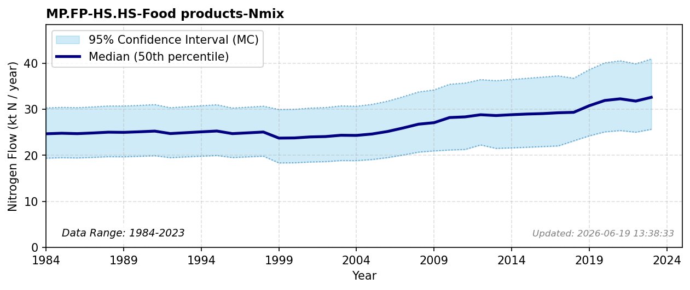

# Food Products to Consumers

### Flow Description
**MP.FP-HS.HS-Food products-Nmix** is food products consumed by private households including restaurants and pets. Schäppi (2025) advises using FAO statistics on food availability for human food consumption, but this only gives data back to 2009. The values in this statistic gives a bit more than 40 ktN per year. We have chosen to use data on food sales to consumers from SSB (table 13695: Næringsinnhald per dag frå selde mat- og drikkevarer 2018 – 2023, table 10249: Forbrukte mengder av mat- og drikkevarer per person per år, etter varegruppe (kg/liter) (avslutta serie) 1999 – 2012 and table 06376: Forbrukte mengder av mat- og drikkevarer per person per år, etter varegruppe (kg/liter) (avslutta serie) 1958-1959 - 1996-1998). The latter series gives values for 3 year averages, and we have assigned the averages to each individual year.\n\nFrom 2018 the statistics are given in terms of protein content. Previous to this, the amounts of various food categories are given, and we have used protein contents found in Matvaretabellen (Mattilsynet, 2006) as this reflects common foods found in Norwegian retail. Population data are taken from SSB and we have used the Jones factor of 6.25 for nitrogen content in protein.\n\nFor pet food, we have assumed (based on available statistics) that cats and dogs consume > 90 % of pet food. Horses are accounted for under the agriculture pool. The nitrogen intake per animal per year is taken from Table 19 in Schäppi (2025) and the number of cats and dogs between 1985 and 2025 is assumed using a trendline based on available statistics from a variety of sources.

### References

* Mattilsynet (2006). *Matvaretabellen*. https://www.matvaretabellen.no
* Schäppi (2025). *Annexes to the {Guidance} {Document} on {NNB*.
