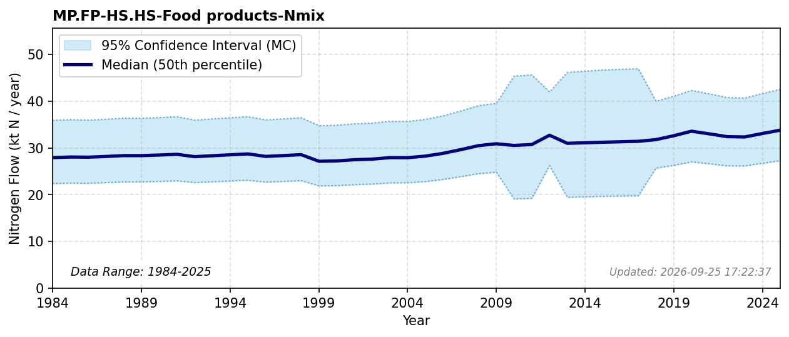

# Food Products to Consumers

### Flow Description
**MP.FP-HS.HS-Food products-Nmix** is food products consumed by private households including restaurants and pets. Schäppi et al. (2025) advises using FAO statistics on food availability for human food consumption, but this only gives data back to 2009. The values in this statistic gives a bit more than 40 ktN per year. We have chosen to use data on food sales to consumers from SSB (table 13695: Næringsinnhald per dag frå selde mat- og drikkevarer 2018 – 2023, table 10249: Forbrukte mengder av mat- og drikkevarer per person per år, etter varegruppe (kg/liter) (avslutta serie) 1999 – 2012 and table 06376: Forbrukte mengder av mat- og drikkevarer per person per år, etter varegruppe (kg/liter) (avslutta serie) 1958-1959 - 1996-1998). The latter series gives values for 3 year averages, and we have assigned the averages to each individual year.

From 2018 the statistics are given in terms of protein content. Previous to this, the amounts of various food categories are given, and we have used protein contents found in Matvaretabellen (Mattilsynet, 2006) as this reflects common foods found in Norwegian retail. Population data are taken from SSB and we have used the Jones factor of 6.25 for nitrogen content in protein.

For pet food, we have assumed (based on available statistics) that cats and dogs consume > 90 % of pet food. Horses are accounted for under the agriculture pool. The nitrogen intake per animal per year is taken from Table 19 in Schäppi et al. (2025) and the number of cats and dogs between 1985 and 2025 is assumed using a trendline based on available statistics from a variety of sources.

The values above reflect food actually eaten, so food that physically left MP.FP but is later discarded at wholesale, retail, food service, catering/institutions or in the household is not included, even though it did leave FP. That same food waste is counted as N entering the household waste flow (see "Household Waste", HS.HS-PR.SO), sourced independently from SSB's waste-by-material statistics - so without a correction, that waste N would have no traceable inflow to HS.HS at all. We therefore add a downstream food waste term using per-sector 2021 tonnage and the 2015-to-2021 change per capita for wholesale, retail, food service, catering and education/care institutions reported by Stensgård et al. (2023) (Norway's food waste reduction agreement, "Bransjeavtalen", uses 2015 as its baseline year), linearly interpolated between the two years and held constant outside that range. This is converted to N using the mean N content of Norway's total food supply basket across 2010-2023 (FAOSTAT Food Balance Sheets "Food" quantity by item, weighted by N content per Table 21 in Schäppi et al. (2025)). Food waste occurring upstream of MP.FP (agriculture, seafood landing) or internally within the food industry is excluded, since both are already covered by other flows.

### References

* Mattilsynet (2006). *Matvaretabellen*. [https://www.matvaretabellen.no](https://www.matvaretabellen.no)
* Schäppi, B., Reutimann, J., Bogler, S., & Ehrler, A. (2025). *Detailed Annexes to ECE/EB.AIR/119 – “Guidance document on national nitrogen budgets*. [https://www.clrtap-tfrn.org/sites/default/files/2025-05/Annexes%20to%20the%20Guidance%20Document%20on%20NNB.pdf](https://www.clrtap-tfrn.org/sites/default/files/2025-05/Annexes%20to%20the%20Guidance%20Document%20on%20NNB.pdf)
* Stensgård, A., Berntsen, I. C., Hohle, S. M., & Callewaert, P. (2023). *Kartleggingsrapport for matbransjen og forbrukerleddet*.
