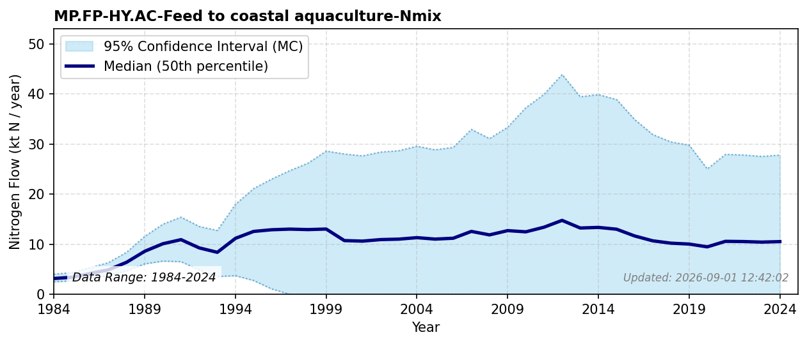

# Feed to Coastal Aquaculture

### Flow Description
**MP.FP-HY.AC-Feed to coastal aquaculture-Nmix**: the amount of feed per ton of produced fish is found by assuming a whole-fish protein (N) retention rising from 26% in 1990 to a 35.75% plateau from 2010 onward (see the [methodological note](../hydrosphere_pool/subpool_aquaculture.html) on the Aquaculture (HY.AC) subpool page for details and sources). The amount of produced fish is found by using data from Fiskeridirektoratet (Fiskeridirektoratet, 2025) on sold farmed fish. This flow represents only the domestically supplied share of feed - about 89% in the mid-1980s, falling to 8% by 2020 as the import fraction rises (see the same methodological note for details); the remaining, imported share is accounted for elsewhere as an import flow.

Hohmann-Marriott (2025) found the nitrogen content in aquaculture feed in 2020 to be 124 ktN, which is very similar to our results.

### References

* Fiskeridirektoratet (2025). *A.06.002 Matfisk. Salg av laks, regnbueørret og ørret, etter art (Fylke) (1994-2024)*. [https://statistikkbanken.fiskeridir.no/PxWeb/pxweb/no/Fiskeridirektoratet/Fiskeridirektoratet__A%20Akvakultur__A.06%20Salg/A06002.px/](https://statistikkbanken.fiskeridir.no/PxWeb/pxweb/no/Fiskeridirektoratet/Fiskeridirektoratet__A%20Akvakultur__A.06%20Salg/A06002.px/)
* Hohmann-Marriott, M. F. (2025). A Nitrogen budget for Norway analysis of Nitrogen flows from societal and natural sources (1961–2020). *PLOS ONE, 20*(2), e0313598. [https://doi.org/10.1371/journal.pone.0313598](https://doi.org/10.1371/journal.pone.0313598)
