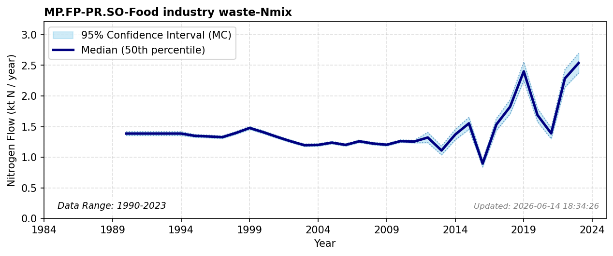

# Food Industry Waste

### Flow Description
**MP.FP-PR.SO-Food industry waste-Nmix** is food waste from the food industry, including the primary sector (fisheries and slaughter houses). We use data from SSB table 05282 “Avfallsregnskap for Norge (1 000 tonn), etter materialtype, statistikkvariabel, år og kilde” (1995-2011) and 10514 «Avfallsregnskap for Norge, etter kilde og materialtype (1 000 tonn) 2012 – 2023» and the category “wet organic waste” with N content from Schäppi (2025). The statistic does not separate between food and other industry waste. According to Chaudhary (2025) everything in the industry category “wet organic waste” is from the food industry.

Prior to 2012, the category “wet organic waste” included park- and garden waste and some other mixed waste. The values reported from 1995 to 2011 are therefore significantly larger than from 2012. To compensate from this we make the assumption that the 2011 value should have been equal to that in 2012, and scale the values prior to 2011 by the ratio between the 2011 and 2012 value. For 1990-1994 we extrapolate using the mean value for years 1995-1999 (5 years).

### References

* Chaudhary, M. & Skjerpen, C. (2025). *Matavfall og matsvinnstatistikk*.
* Schäppi, B., Reutimann, J., Bogler, S., & Ehrler, A. (2025). *Detailed Annexes to ECE/EB.AIR/119 – “Guidance document on national nitrogen budgets*. [https://www.clrtap-tfrn.org/sites/default/files/2025-05/Annexes%20to%20the%20Guidance%20Document%20on%20NNB.pdf](https://www.clrtap-tfrn.org/sites/default/files/2025-05/Annexes%20to%20the%20Guidance%20Document%20on%20NNB.pdf)
