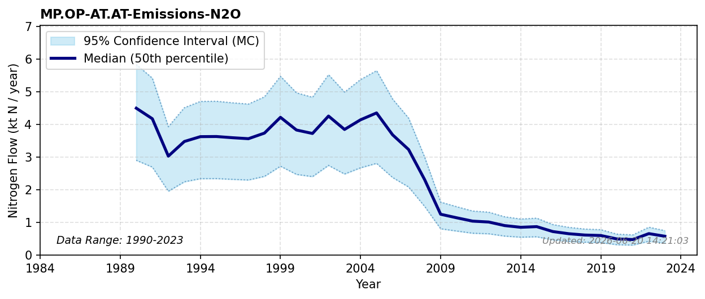

# Industrial Emissions (N2O)

### Flow Description
**MP.OP-AT.AT-Emissions-N2O** are taken from UNFCCC common reporting tables, Table 3 as advised by \\citet{schappi_annexes_2025}. Emissions are substantial, at least before 2009, and the main source of emissions is from nitric acid production.

### References


