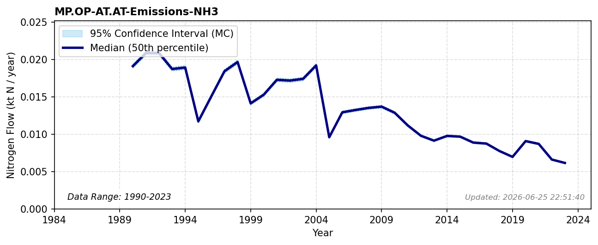

# Industrial Emissions (NH3)

### Flow Description
We have used data from CLRTAP Inventory Submissions \\citep{emep_clrtap_2025} as advised by \\citet{schappi_annexes_2025}, using the categories given in Table 20.

### References

* Missing reference data for key: `emep_clrtap_2025`
* Schäppi (2025). *Annexes to the {Guidance} {Document} on {NNB*.
