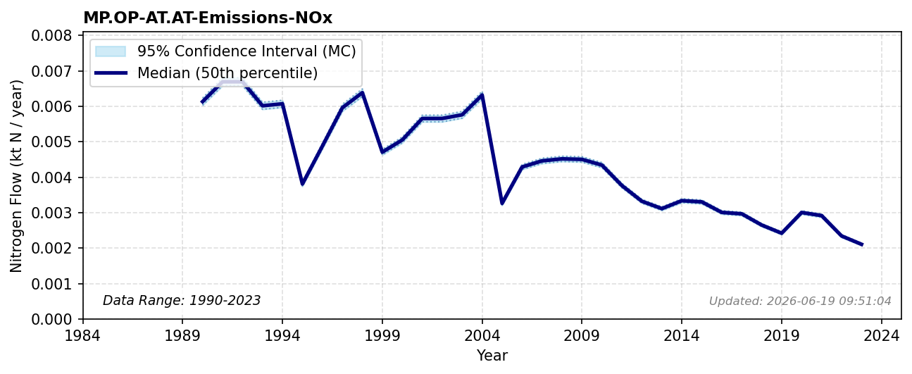

# Industrial Emissions (NOx)

### Flow Description
We have used data from CLRTAP Inventory Submissions (emep_clrtap_2025) as advised by Schäppi (2025), using the categories given in Table 20.

### References

* Missing reference data for key: `emep_clrtap_2025`
* Schäppi (2025). *Annexes to the {Guidance} {Document} on {NNB*.
