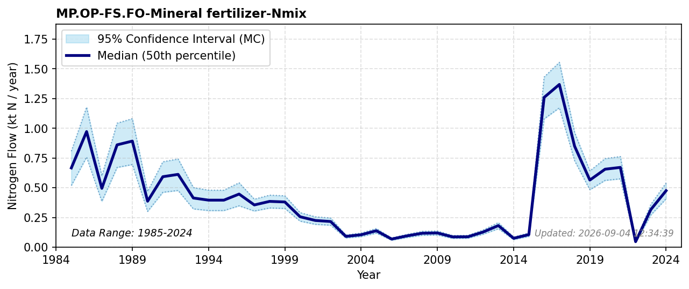

# Mineral Fertilizer for Forestry

### Flow Description
**MP.OP-FS.FO-Mineral fertilizer-Nmix** is nitrogen for forest fertilization. This flow is not part of the guidelines but has been added because it is a significant flow in Norway, as was also done in the Swedish NNB (Moldan et al., 2025). We have used data from SSB on area of forest fertilized and assumed a standard value of 15 kgN/da (Dalen, 2017). Fertilized area before 1997 is taken from Figure 2 in Landbruksdirektoratet (2021).

### References

* Dalen, L. S. (2017). Lønnsomt å gjødsle skog. *NIBIO.no*. [https://www.nibio.no/nyheter/lnnsomt--gjdsle-skog](https://www.nibio.no/nyheter/lnnsomt--gjdsle-skog)
* Landbruksdirektoratet (2021). *Vurdering av tilskuddsordning for gjødsling av skog*. [https://www.landbruksdirektoratet.no/nb/filarkiv/rapporter/Vurdering%20av%20tilskuddsordning%20for%20gj%C3%B8dsling%20av%20skog%20Rapport%2036_2021.pdf/_/attachment/inline/84ce3162-0ff6-43ac-b5ae-c307356a24a2:1e9b2813fc7c081951e5211b724ca37baef0bf53/Vurdering%20av%20tilskuddsordning%20for%20gj%C3%B8dsling%20av%20skog%20Rapport%2036_2021.pdf](https://www.landbruksdirektoratet.no/nb/filarkiv/rapporter/Vurdering%20av%20tilskuddsordning%20for%20gj%C3%B8dsling%20av%20skog%20Rapport%2036_2021.pdf/_/attachment/inline/84ce3162-0ff6-43ac-b5ae-c307356a24a2:1e9b2813fc7c081951e5211b724ca37baef0bf53/Vurdering%20av%20tilskuddsordning%20for%20gj%C3%B8dsling%20av%20skog%20Rapport%2036_2021.pdf)
* Moldan, F., Stadmark, J., Jutterström, S., & Ljunggren, J. (2025). Where does Sweden’s nitrogen go? Building a comprehensive national nitrogen budget. *Environmental Research Letters, 20*(12), 124068. [https://doi.org/10.1088/1748-9326/ae2697](https://doi.org/10.1088/1748-9326/ae2697)
