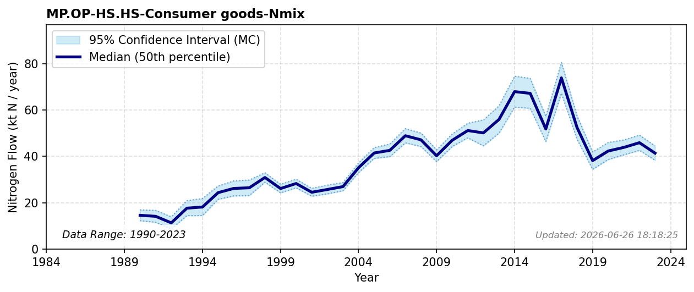

# Consumer Goods (Mass Balance)

### Flow Description
**MP.OP-HS.HS-Consumer goods-Nmix** is calculated by mass balance, assuming that all incoming flows to OP that are not accounted for in outgoing flows end up in domestic consumer goods. We have excluded N2 fixation for ammonia synthesis, and mineral fertilizer flows. We also exclude emissions to air from the balance because they result mainly from fertilizer production.\n\n**Incoming flows:**\n* AG.SM-MP.OP-Crop products for industrial use-Nmix\n* AG.MM-MP.OP-Non-edible animal products-Nmix\n* PR.SO-MP.OP-Recycling-Nmix\n* EF.EC-MP.OP-Fuel used as feedstock-Nmix\n* FS.FO-MP.OP-Industrial round wood-Nmix\n* RW.RW-MP.OP-Other goods import -Nmix\n\n**Outgoing flows:**\n* MP.OP-PR.SO-Other industry waste-Nmix\n* MP.OP-PR.WW-Other industry wastewater-Nmix\n* MP.OP-HY.SW-Untreated wastewater-Nmix\n* MP.OP-RW.RW-Other goods export-Nmix\n* MP.OP-EF.IC-Industrial waste fuels-Nmix\n\nFor comparison, moldan_swedish_2025 (n.d.) found flows from MP to HS of 15.9 ktN in the form of wood products (produced – export – waste) and 52.2 ktN in the form of chemical products, also found by mass balance, and identified as “plastics, deicing agents, glue, paint, tensides, etc.”, giving a total of 68.1 ktN which, given that the Swedish population is larger than that of Norway, agrees well with our findings.

### References

* Missing reference data for key: `moldan_swedish_2025`
