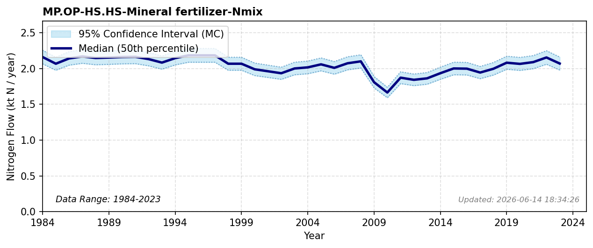

# Non-Agricultural Mineral Fertilizer

### Flow Description
**MP.OP-HS.HS-Mineral fertilizer-Nmix**: as advised by (Schäppi, 2025), we assume a default value of 2% of total mineral fertilizer for non-agricultural use. Data for fertilizer use in agriculture are taken from FAOSTAT Fertilizer by nutrient (FAO, 2025).

### References


