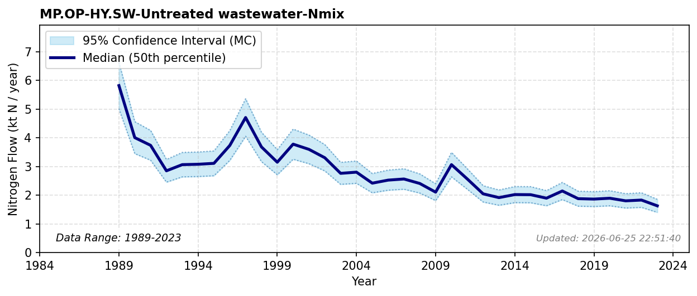

# Untreated Wastewater (Other Industry)

### Flow Description
**MP.OP-HY.SW-Untreated wastewater-Nmix** is found using data from Miljødirektoratet (personal communication, 2026) on emissions to water from individual industries, where industries are categorized as belonging to OP or FP based on the information given in the statistic, and counting those that are not reported to be connected to municipal wastewater treatment. These emissions are also reported by Miljødirektoratet \\citep{miljodirektoratet_norske_2025}, but as of February 2026 the publicly available data did not include information on connection to municipal wastewater. The database does not distinguish between emissions to surface and coastal waters, so even though several large industries discharge their wastewater to the coast, we assign this entire flow to SW in order to avoid double counting.

### References


