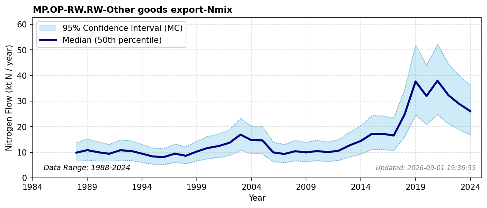

# Other Goods Export

### Flow Description
**MP.OP-RW.RW-Other goods export-Nmix** is taken from SSB trade data (table 08801) on goods that can be characterized as flowers, chemicals, soap, industrial protein, leather, wood, textiles, and ammonia. Within the plastics and synthetic-textile trade categories, N content is assigned by base polymer rather than a single blended factor: nitrogen-containing polymers (polyamide/nylon, polyurethane, melamine and urea formaldehyde resins, polyacrylonitrile) use the N contents given in Schäppi et al. (2025), Table 23, while ordinary commodity plastics and fibres with no nitrogen in their polymer backbone (polyethylene, polypropylene, PVC, polystyrene, polyester, viscose/rayon, cotton) are assigned ~0. The same principle applies to clothing, footwear and other finished textile articles: items explicitly of wool use the protein-fibre N content from Schäppi et al. (2025), Table 24 (as for silk), items with a leather component use the same N content as hides and skins, and items of cotton or unspecified synthetic/artificial fibre (predominantly polyester, which - like cotton - has no nitrogen in its polymer backbone) default to ~0.

### References

* Schäppi, B., Reutimann, J., Bogler, S., & Ehrler, A. (2025). *Detailed Annexes to ECE/EB.AIR/119 – “Guidance document on national nitrogen budgets*. [https://www.clrtap-tfrn.org/sites/default/files/2025-05/Annexes%20to%20the%20Guidance%20Document%20on%20NNB.pdf](https://www.clrtap-tfrn.org/sites/default/files/2025-05/Annexes%20to%20the%20Guidance%20Document%20on%20NNB.pdf)
