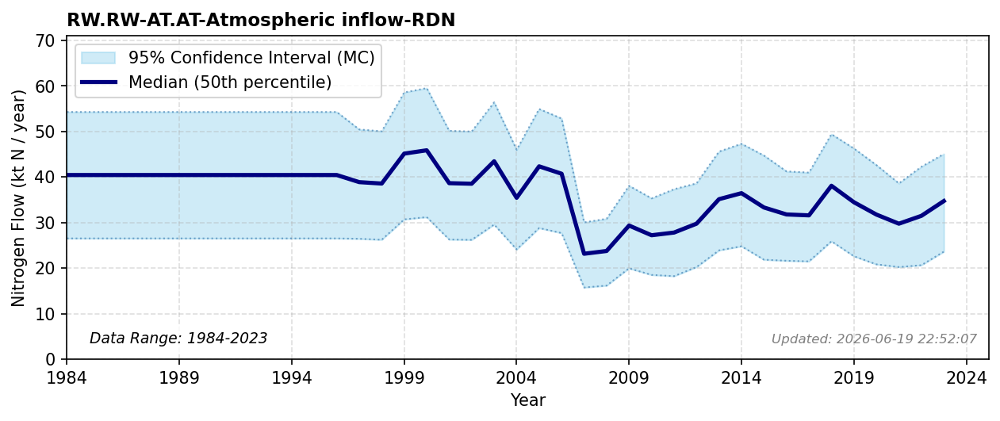

# Atmospheric Inflow (Reduced N)

### Flow Description
Is found from source-receptor data from EMEP, as advised by (Schäppi et al., 2025). There is a change in methodology in the EMEP reporting between 2002 and 2003 data.

### References

* Schäppi, B., Reutimann, J., Bogler, S., & Ehrler, A. (2025). *Detailed Annexes to ECE/EB.AIR/119 – “Guidance document on national nitrogen budgets*. https://www.clrtap-tfrn.org/sites/default/files/2025-05/Annexes%20to%20the%20Guidance%20Document%20on%20NNB.pdf
