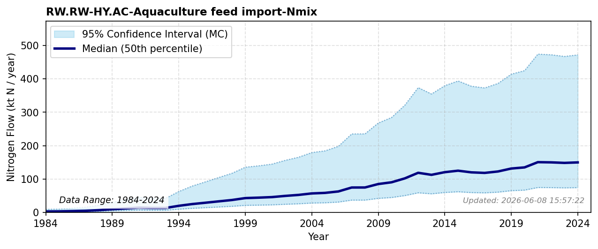

# Aquaculture Feed Import

### Flow Description
We assume a constant import fraction of 0.92 as given by Aas et al. (2022) for the year 2020. The amount of feed used is based on the amount of fish produced, calculated using data from Fiskeridirektoratet (2025)on sold farmed fish, assuming average protein (N) retention of 35,75 % (Aas et al., 2022), 2.8 % nitrogen content in fish and shellfish  Schäppi et al. (2025), p. 254) and 3% feed waste Wang et al. (2013).

### References

* Aas, T. S., Åsgård, T., & Ytrestøyl, T. (2022). Utilization of feed resources in the production of {Atlantic} salmon ({Salmo} salar) in {Norway}: {An} update for 2020. *Aquaculture Reports, 26*, 101316. https://doi.org/10.1016/j.aqrep.2022.101316
* Fiskeridirektoratet (2025). *A.06.002 {Matfisk}. {Salg} av laks, regnbueørret og ørret, etter art ({Fylke}) (1994-2024)*. https://statistikkbanken.fiskeridir.no/PxWeb/pxweb/no/Fiskeridirektoratet/Fiskeridirektoratet__A%20Akvakultur__A.06%20Salg/A06002.px/
* Schäppi, B., Reutimann, J., Bogler, S., & Ehrler, A. (2025). *Detailed Annexes to ECE/EB.AIR/119 – “Guidance document on national nitrogen budgets*. https://www.clrtap-tfrn.org/sites/default/files/2025-05/Annexes%20to%20the%20Guidance%20Document%20on%20NNB.pdf
* Wang, X., Andresen, K., Handå, A., Jensen, B., Reitan, K., & Olsen, Y. (2013). Chemical composition and release rate of waste discharge from an {Atlantic} salmon farm with an evaluation of {IMTA} feasibility. *Aquaculture Environment Interactions, 4*(2), 147-162. https://doi.org/10.3354/aei00079
