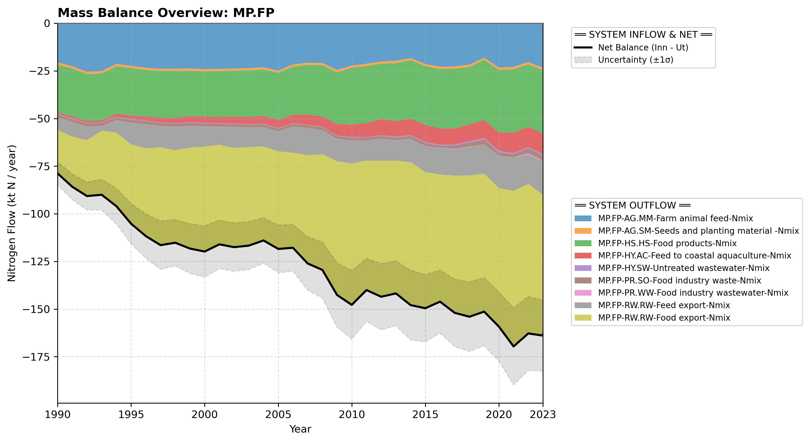

# Subpool: Food and feed processing (MP.FP)

---

## Mass Balance Overview (1990-2023)

The chart below illustrates the integrated nitrogen mass balance for **MP.FP**. It includes total system inflows (positive stack), total outflows (negative stack), and the net balance line with estimated uncertainty bounds (±1σ).

### Flows that are zero or neglected:

* **MP.FP-HY.AC-Feed to freshwater aquaculture-Nmix** is set to zero because it is assumed all (except a negligible amount) aquaculture takes place in coastal waters.
* **MP.FP-PR.SO-Organic waste as biofuels substrate-Nmix** and **MP.FP-PR.SO-Organic waste for composting-Nmix** are not given as separate flows; instead they are included in the flow **MP.FP-PR.SO-Food industry waste-Nmix** because official statistics do not clearly indicate what origin waste flows end up in different end uses.

### References


