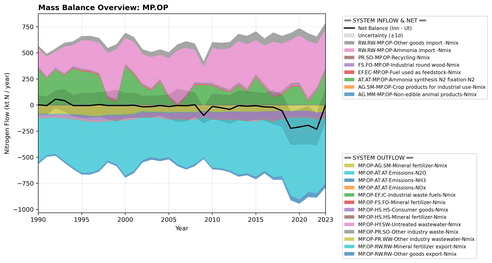

# Subpool: Other producing industry (MP.OP)

---

## Mass Balance Overview (1990-2023)

The chart below illustrates the integrated nitrogen mass balance for **MP.OP**. It includes total system inflows (positive stack), total outflows (negative stack), and the net balance line with estimated uncertainty bounds (±1σ).

### Flows that are zero or neglected:

* **MP.OP-EF.TR-Ammonia as fuel-NH3** is set to zero because there is negligible use of ammonia as fuel today.

### References


