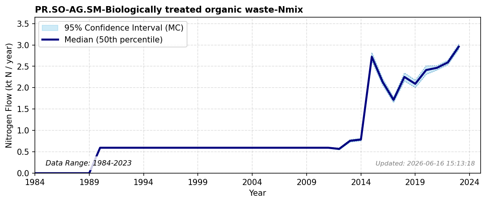

# Biologically treated organic waste to Ag

### Flow Description
**PR.SO-AG.SM-Biologically treated organic waste-Nmix** includes all forms of organic waste except sewage sludge that is organically treated and used in agricultural soils. Biological treatment of organic waste includes both composting and biogas production, but in Norway, most of the waste composted in the municipal waste sector is used on the private sector, not in agriculture. We therefore only include biogas digestate in this flow.\n\nAccording to Biogass Norge, biogas digestate is produced from sewage sludge, manure, fish waste and sludge, and food waste. General frameworks for urban and regional nitrogen recycling from waste management are detailed in \\citep{{kaltenegger_urban_2023}}. From 2018 to 2020, we use data on the disposal of biologically produced waste from SSB table 12818 where we find the N content of what is used in agriculture by scaling the N content of the amount used in 2021.\n\nFrom 2012 to 2017, we use data on biogas treatment of different waste categories from SSB table 10513 “Avfallsregnskap for Norge (1 000 tonn), etter materialtype, statistikkvariabel, år og behandlingsmåte” assuming that 85 % of this is used in agriculture with a loss of 10 % N during biological treatment.\n\nAccording to SSB, there were 8 biogas plants in 2011 and 35 in 2017. We therefore assume values before 2012 to be negligible and set those flows to zero.

### References


