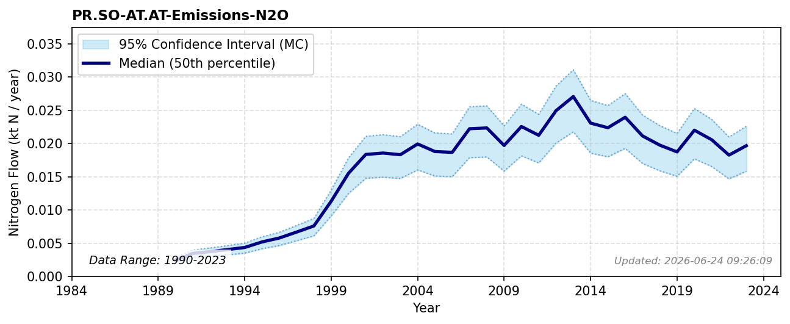

# N2O Emissions (Solid Waste)

### Flow Description
**PR.SO-AT.AT-Emissions-N2O** is taken from UNFCCC Common reporting tables, where we have included emissions from landfills, waste incineration and biofuel production. Global trends of changing reactive nitrogen emissions are evaluated in [^malik_drivers_2022].

### References

[^oita_substantial_2016]: Oita, Azusa, Malik, Arunima, Kanemoto, Keiichiro, Geschke, Arne, Nishijima, Shota, Lenzen, Manfred (2016). *Substantial nitrogen pollution embedded in international trade*. *Nature Geoscience* 9, pp. 111--115.
[^hamilton_trade_2018]: Hamilton, Helen A., Ivanova, Diana, Stadler, Konstantin, Merciai, Stefano, Schmidt, Jannick, van Zelm, Rosalie, Moran, Daniel, Wood, Richard (2018). *Trade and the role of non-food commodities for global eutrophication*. *Nature Sustainability* 1, pp. 314--321.
[^malik_drivers_2022]: Malik, Arunima, Oita, Azusa, Shaw, Emily, Li, Mengyu, Ninpanit, Panittra, Nandel, Vibhuti, Lan, Jun, Lenzen, Manfred (2022). *Drivers of global nitrogen emissions*. *Environmental Research Letters* 17, pp. 015006.
[^lassaletta_nitrogen_2016]: Lassaletta, Luis, Billen, Gilles, Garnier, Josette, Bouwman, Lex, Velazquez, Eduardo, Mueller, Nathaniel D., Gerber, James S. (2016). *Nitrogen use in the global food system: past trends and future trajectories of agronomic performance, pollution, trade, and dietary demand*. *Environmental Research Letters* 11, pp. 095007.
[^smil_nitrogen_1999]: Smil, Vaclav (1999). *Nitrogen in crop production: An account of global flows*. *Global Biogeochemical Cycles* 13, pp. 647--662.
[^chen_bunkering_2024]: Chen, Mengli, Jiang, Shan, Han, Aiqin, Yang, Mengyao, Tkalich, Pavel, Liu, Ming (2024). *Bunkering for change: Knowledge preparedness on the environmental aspect of ammonia as a marine fuel*. *Science of The Total Environment* 907, pp. 167677.
[^starck_fate_2023]: Starck, Thomas, Fardet, Tanguy, Esculier, Fabien (2023). *Fate of nitrogen in French human excreta: current waste and agronomic opportunities for the future*. *arXiv*.
[^bertagni_minimizing_2023]: Bertagni, Matteo B., Socolow, Robert H., Martirez, John Mark P., Carter, Emily A., Greig, Chris, Ju, Yiguang, Lieuwen, Tim, Mueller, Michael E., Sundaresan, Sankaran, Wang, Rui, Zondlo, Mark A., Porporato, Amilcare (2023). *Minimizing the impacts of the ammonia economy on the nitrogen cycle and climate*. *Proceedings of the National Academy of Sciences* 120, pp. e2311728120.
[^kaltenegger_urban_2023]: Kaltenegger, Katrin, Bai, Zhaohai, Dragosits, Ulrike, Fan, Xiangwen, Greinert, Andrzej, Guéret, Samuel, Suchowska-Kisielewicz, Monika, Winiwarter, Wilfried, Zhang, Lin, Zhou, Feng (2023). *Urban nitrogen budgets: Evaluating and comparing the path of nitrogen through cities for improved management*. *Science of The Total Environment* 904, pp. 166827.
[^schulte-uebbing_planetary_2022]: Schulte-Uebbing, L. F., Beusen, A. H. W., Bouwman, A. F., de Vries, W. (2022). *From planetary to regional boundaries for agricultural nitrogen pollution*. *Nature* 610, pp. 507--512.
[^ackerman_global_2019]: Ackerman, Daniel, Millet, Dylan B., Chen, Xin (2019). *Global Estimates of Inorganic Nitrogen Deposition Across Four Decades*. *Global Biogeochemical Cycles* 33, pp. 100--107.
[^fowler_global_2013]: Fowler, David, Coyle, Mhairi, Skiba, Ute, Sutton, Mark A., Cape, J. Neil, Reis, Stefan, Sheppard, Lucy J., Jenkins, Alan, Grizzetti, Bruna, Galloway, James N., Vitousek, Peter, Leach, Allison, Bouwman, Alexander F., Butterbach-Bahl, Klaus, Dentener, Frank, Stevenson, David, Amann, Marcus, Voss, Maren (2013). *The global nitrogen cycle in the twenty-first century*. *Philosophical Transactions of the Royal Society B: Biological Sciences* 368, pp. 20130164.
[^staalstrom_utredning_2022]: Staalstrøm, André, Walday, Mats, Vogelsang, Christian, Frigstad, Helene, Borgersen, Gunhild, Albretsen, Jon, Naustvoll, Lars-Johan (2022). *Utredning av behovet for å redusere tilførslene av nitrogen til Ytre Oslofjord*..
[^eide_nitrogen_2023]: Eide, Gunn (2023). *Nitrogen til nytte i jordbruket Rapport Ldir Mdir 22 2023.pdf*..
[^lyche_beregninger_2011]: Lyche, Arnar (2011). *Beregninger av nitrogenbalansen på 50 gårdsbruk i kommunene Midsund, Fræna, Gjemnes, Surnadal og Rindal*..
[^sutton_nitrogen_2022]: Sutton, M.A., Howard, C.M., Mason, K.E., Brownlie, Cordovil, C.M. (2022). *Nitrogen Opportunities for Agriculture, Food \& Environment. UNECE Guidance Document on Integrated Sustainable Nitrogen Management.*..
[^landbruksdirektoratet_arbeidsnotat_2018]: Landbruksdirektoratet, Miljødirektoratet (2018). *Arbeidsnotat som underlag for forslag til nytt gjødselregelverk*..
[^miljodirektoratet_gjennomforing_2023]: Miljødirektoratet (2023). *Gjennomføring av helhetlig tiltaksplan for Oslofjorden Rapport for året 2022-2023*..
[^galloway_chronology_2013]: Galloway, James N., Leach, Allison M., Bleeker, Albert, Erisman, Jan Willem (2013). *A chronology of human understanding of the nitrogen cycle†*. *Philosophical Transactions of the Royal Society B: Biological Sciences* 368, pp. 20130120.
[^bleken_nitrogen_1997]: Bleken, Marina Azzaroli, Bakken, Lars R. (1997). *The Nitrogen Cost of Food Production: Norwegian Society*. *Ambio* 26, pp. 134--142.
[^galloway_footprint_2024]: Galloway, James N, Castner, Elizabeth A, Dukes, Elizabeth S M, Fox, Jessica, Leach, Allison M (2024). *Footprint tools tiptoeing towards nitrogen sustainability*. *Environmental Research Letters* 19, pp. 103003.
[^steinshamn_utilization_2004]: Steinshamn, Håvard, Thuen, Erling, Bleken, Marina Azzaroli, Brenøe, Ulrik Tutein, Ekerholt, Georg, Yri, Cecilie (2004). *Utilization of nitrogen (N) and phosphorus (P) in an organic dairy farming system in Norway*. *Agriculture, Ecosystems \& Environment* 104, pp. 509--522.
[^landbruksdirektoratet_vurdering_2021]: Landbruksdirektoratet (2021). *Vurdering av tilskuddsordning for gjødsling av skog*..
[^islam_nitrogen_2005]: Islam, Md. Shahidul (2005). *Nitrogen and phosphorus budget in coastal and marine cage aquaculture and impacts of effluent loading on ecosystem: review and analysis towards model development*. *Marine Pollution Bulletin* 50, pp. 48--61.
[^wang_discharge_2012]: Wang, Xinxin, Olsen, Lasse Mork, Reitan, Kjell Inge, Olsen, Yngvar (2012). *Discharge of nutrient wastes from salmon farms: environmental effects, and potential for integrated multi-trophic aquaculture*. *Aquaculture Environment Interactions* 2, pp. 267--283.
[^almas_veikart_2023]: Almås, Karl A, Schrøder, B, Nymark, Marianne, Aursand, Ida G (2023). *Veikart for industriell fremstilling av norske fôrråvarer (protein)*..
[^lovdata_forskrift_2004]: Lovdata (2004). *Forskrift om begrensning av forurensning (forurensningsforskriften) - Del 4. Avløp - Lovdata*..
[^lyng_biorest_nodate]: Lyng, Kari-Anne, Og, Anna Woodhouse, Samsonstuen, Stine (n.d.). *Biorest fra marine råstoffer og husdyrgjødsel: Klimapåvirkning og gjenvinning av nitrogen og fosfor*..
[^stensgard_matsvinn_2018]: Stensgård, Aina Elstad, Prestrud, Kjersti, Hanssen, Ole Jørgen, Callewaert, Pieter (2018). *Matsvinn i Norge Rapportering av nøkkeltall 2015-2017*..
[^helsedirektoratet_utviklingen_2022]: Helsedirektoratet (2022). *Utviklingen i norsk kosthold 2022 - Kortversjon*..
[^wang_quantifying_2023]: Wang, Cd, Olsen, Y (2023). *Quantifying regional feed utilization, production and nutrient waste emission of Norwegian salmon cage aquaculture*. *Aquaculture Environment Interactions* 15, pp. 231--249.
[^bechmann_tiltak_2023]: Bechmann, Nibio, Frøseth, Randi Berland, Rivedal, Synnøve, Brod, Eva, Fischer, Franziska, Seehusen, Till, Øgaard, Anne Falk (2023). *Tiltak for bedre nitrogenforvaltning i norsk jordbruk*..
[^donnum_markedet_2023]: Dønnum, Amund, Olsvik, Egil (2023). *Markedet for norsk matkorn*..
[^sample_kildefordelte_2024]: Sample, James Edward (2024). *Kildefordelte tilførsler av nitrogen og fosfor til norske kystområder i 2022 – tabeller, figurer og kart*..
[^naerings-_og_fiskeridepartementet_fremtidens_2025]: og Fiskeridepartementet, Nærings- (2025). *Fremtidens havbruk. Bærekraftig vekst og mat til verden*..
[^grefsrud_risikorapport_2025]: Grefsrud, Ellen Sofie, Andersen, Lasse Berg, Agnalt, Ann-Lisbeth, m.fl. (2025). *Risikorapport norsk fiskeoppdrett 2025*..
[^vos_danish_2025]: Vos, Jacques Louis, Leach, Allison M, Galloway, James N, Dalgaard, Tommy, Graversgaard, Morten (2025). *The Danish nitrogen footprint: balancing regulation with individual environmental responsibility*. *Environmental Research Letters* 20, pp. 054026.
[^leach_nitrogen_2012]: Leach, Allison M., Galloway, James N., Bleeker, Albert, Erisman, Jan Willem, Kohn, Richard, Kitzes, Justin (2012). *A nitrogen footprint model to help consumers understand their role in nitrogen losses to the environment*. *Environmental Development* 1, pp. 40--66.
[^eidem_for-_2022]: Eidem, Bjørn, Ruud, Tommy (2022). *Fôr- og husdyrbaserte verdikjeder i norsk matproduksjon – nåsituasjon og begreper*..
[^grados_quantification_2025]: Grados, Diego, Einarsson, Rasmus, Sanz-Cobeña, Alberto, Olesen, Jørgen Eivind, Børsting, Christian Friis, Abalos, Diego (2025). *Quantification and comparison of subnational and national agricultural nitrogen flows in Denmark and Sweden*. *Environmental Research Letters* 20, pp. 054041.
[^blake_deposition_2023]: Blake, Lewis R, Aas, Wenche, Denby, Bruce, Hjellbrekke, Anne, Mu, Qing, Simpson, David, Fagerli, Hilde (2023). *Deposition of sulfur and nitrogen in Norway 2017-2021*..
[^gronlund_kalkulator_2015]: Grønlund, Arne (2015). *Kalkulator for klimagassutslipp fra jordbruket*..
[^hellsten_abating_2019]: Hellsten, Sofie, Dalgaard, Tommy, Rankinen, Katri, Tørseth, Kjetil, Bakken, Lars, Bechmann, Marianne, Kulmala, Airi, Moldan, Filip, Olofsson, Stina, Piil, Kristoffer, Pira, Kajsa, Turtola, Eila (2019). *Abating N in Nordic agriculture - Policy, measures and way forward*. *Journal of Environmental Management* 236, pp. 674--686.
[^myhre_analyse_2022]: Myhre, Magnus Stoud, Richardsen, Roger, Nystøyl, Ragnar, Strandheim, Gunn (2022). *Analyse marint restråstoff 2021*. *SINTEF Ocean AS*.
[^sutton_nitrogen_2011]: Jarvis, Steve, Hutchings, Nick, Brentrup, Frank, Olesen, Jorgen Eivind, Van De Hoek, Klaas W. (2011). *Nitrogen flows in farming systems across Europe*. *Cambridge University Press*, pp. 211--228.
[^sutton_nitrogen_2011-1]: Svirejeva-Hopkins, Anastasia, Reis, Stefan, Magid, Jakob, Nardoto, Gabriela B., Barles, Sabine, Bouwman, Alexander F., Erzi, Ipek, Kousoulidou, Marina, Howard, Clare M., Sutton, Mark A. (2011). *Nitrogen flows and fate in urban landscapes*. *Cambridge University Press*, pp. 249--270.
[^sutton_nitrogen_2011-2]: Billen, Gilles, Silvestre, Marie, Grizzetti, Bruna, Leip, Adrian, Garnier, Josette, Voss, Maren, Howarth, Robert, Bouraoui, Fayçal, Lepistö, Ahti, Kortelainen, Pirkko, Johnes, Penny, Curtis, Chris, Humborg, Christoph, Smedberg, Erik, Kaste, Øyvind, Ganeshram, Raja, Beusen, Arthur, Lancelot, Christiane (2011). *Nitrogen flows from European regional watersheds to coastal marine waters*. *Cambridge University Press*, pp. 271--297.
[^sutton_geographical_2011]: De Vries, Wim, Leip, Adrian, Reinds, Gert Jan, Kros, Johannes, Lesschen, Jan Peter, Bouwman, Alexander F., Grizzetti, Bruna, Bouraoui, Fayçal, Butterbach-Bahl, Klaus, Bergamaschi, Peter, Winiwarter, Wilfried (2011). *Geographical variation in terrestrial nitrogen budgets across Europe*. *Cambridge University Press*, pp. 317--344.
[^sutton_integrating_2011]: Leip, Adrian, Achermann, Beat, Billen, Gilles, Bleeker, Albert, Bouwman, Alexander F., De Vries, Wim, Dragosits, Ulli, Döring, Ulrike, Fernall, Dave, Geupel, Markus, Herolstab, Jürg, Johnes, Penny, Le Gall, Anne Christine, Monni, Suvi, Nevečeřal, Rostislav, Orlandini, Lorenzo, Prud'homme, Michel, Reuter, Hannes I., Simpson, David, Seufert, Guenther, Spranger, Till, Sutton, Mark A., Van Aardenne, John, Voß, Maren, Winiwarter, Wilfried (2011). *Integrating nitrogen fluxes at the European scale*. *Cambridge University Press*, pp. 345--376.
[^le_noe_how_2017]: Le Noë, Julia, Billen, Gilles, Garnier, Josette (2017). *How the structure of agro-food systems shapes nitrogen, phosphorus, and carbon fluxes: The generalized representation of agro-food system applied at the regional scale in France*. *Science of The Total Environment* 586, pp. 42--55.
[^einarsson_crop_2021]: Einarsson, Rasmus, Sanz-Cobena, Alberto, Aguilera, Eduardo, Billen, Gilles, Garnier, Josette, Van Grinsven, Hans J. M., Lassaletta, Luis (2021). *Crop production and nitrogen use in European cropland and grassland 1961–2019*. *Scientific Data* 8, pp. 288.
[^stensgard_kartleggingsrapport_2023]: Stensgård, Aina, Berntsen, Ina Charlotte, Hohle, Sigrid Møyner, Callewaert, Pieter (2023). *Kartleggingsrapport for matbransjen og forbrukerleddet*..
[^nibio_totalkalkylen_2025]: NIBIO (2025). *Totalkalkylen - statistikk*. *Nibio*.
[^miljodirektoratet_norske_2025]: Miljødirektoratet (2025). *Norske utslipp - Utslipp til luft og vann og generert avfall, Nitrogen totalt*..
[^ferter_integrating_2023]: Ferter, Keno, Otterå, Håkon, Christman, Mary, Kleiven, Alf Ring, Weltersbach, Marc Simon, Gundersen, Sofie, Djønne, Christine, Bjelland, Otte, Hartill, Bruce, Lyle, Jeremy, Hyder, Kieran, Borch, Trude, Vølstad, Jon Helge (2023). *Integrating complementary survey methods to estimate catches in Norway’s complex marine recreational hook-and-line fishery*. *ICES Journal of Marine Science* 80, pp. 107--121.
[^kato_nitrogen_2025]: Kato, Kota, Saiki, Makoto, Do, Nga Thu, Mochizuki, Kazuki, Nishida, Kei (2025). *Nitrogen loss in a region with developed food industries: a new method of nitrogen flow and recyclability analysis focusing on distribution system*. *Journal of Material Cycles and Waste Management*.
[^sample_teotil3_2024]: Sample, James Edward, Jackson-Blake, Leah, Vogelsang, Christian, Kaste, Øyvind (2024). *TEOTIL3: En modell for beregning av kildebaserte tilførsler via elver og direktetilførsler til kyst*..
[^kvaerno_agritil_2024]: Kværnø, Sigrun H., Fischer, Franziska, Bechmann, Marianne (2024). *AGRITIL - Nutrient loss model for agriculture Modelling soil, organic carbon, nitrogen and phosphorus losses from Norwegian agricultural areas to surface water*..
[^djukic_austrian_2025]: Djukic, Ika, Broneder, Carina, Dirnböck, Thomas, Gabriel, Oliver, Lindinger, Helga, Loishandl-Weisz, Harald, Mayer, Simone, Nagl, Christian, Poupa, Stephan, Rechberger, Helmut, Sander, Philip, Schwarzl, Bettina, Tanzer, Julia, Weiss, Peter, Winiwarter, Wilfried (2025). *Austrian nitrogen budget following UNECE guidance*. *Environmental Research Letters* 20, pp. 094054.
[^kroeze_uncertainties_2003]: Kroeze (2003). *Uncertainties in the fate of nitrogen I: An overview of sources of uncertainty illustrated with a Dutch case study*..
[^umweltbundesamt_integrated_2020]: Umweltbundesamt (2020). *Integrated nitrogen indicator, national nitrogen target and the current situation in Germany (DESTINO Report 1) UBA-Texte 97/2020*..
[^doering_reactive_2011]: Doering, Otto C., Galloway, James, Theis, Thomas L., Swackhamer, Deborah L. (2011). *Reactive Nitrogen in the United States: An Analysis of Inputs, Flows, Consequences, and Management*..
[^sabo_decadal_2019]: Sabo, Robert D., Clark, Christopher M., Bash, Jesse, Sobota, Daniel, Cooter, Ellen, Dobrowolski, James P., Houlton, Benjamin Z., Rea, Anne, Schwede, Donna, Morford, Scott L., Compton, Jana E. (2019). *Decadal Shift in Nitrogen Inputs and Fluxes Across the Contiguous United States: 2002–2012*. *Journal of Geophysical Research: Biogeosciences* 124, pp. 3104--3124.
[^hutchings_nitrogen_2014]: Hutchings, N J, Nielsen, O-K, Dalgaard, T, Mikkelsen, M H, Børgesen, C D, Thomsen, M, Ellermann, T, Højberg, A L, Mogensen, L, Winther, M (2014). *A nitrogen budget for Denmark; developments between 1990 and 2010, and prospects for the future*. *Environmental Research Letters* 9, pp. 115012.
[^clair_interactions_2014]: Clair, Thomas A., Pelletier, Nathan, Bittman, Shabtai, Leip, Adrian, Arp, Paul, Moran, Michael D., Dennis, Ian, Niemi, David, Sterling, Shannon, Drury, Craig F., Yang, Jingyi (2014). *Interactions between reactive nitrogen and the Canadian landscape: A budget approach*. *Global Biogeochemical Cycles* 28, pp. 1343--1357.
[^worrall_uks_2016]: Worrall, F., Burt, T. P., Howden, N. J. K., Whelan, M. J. (2016). *The UK’s total nitrogen budget from 1990 to 2020: a transition from source to sink?*. *Biogeochemistry* 129, pp. 325--340.
[^gu_integrated_2015]: Gu, Baojing, Ju, Xiaotang, Chang, Jie, Ge, Ying, Vitousek, Peter M. (2015). *Integrated reactive nitrogen budgets and future trends in China*. *Proceedings of the National Academy of Sciences* 112, pp. 8792--8797.
[^zhang_uncertainty_2021]: Zhang, Xiuming, Ren, Chenchen, Gu, Baojing, Chen, Deli (2021). *Uncertainty of nitrogen budget in China*. *Environmental Pollution* 286, pp. 117216.
[^hayashi_nitrogen_2021]: Hayashi, Kentaro, Shibata, Hideaki, Oita, Azusa, Nishina, Kazuya, Ito, Akihiko, Katagiri, Kiwamu, Shindo, Junko, Winiwarter, Wilfried (2021). *Nitrogen budgets in Japan from 2000 to 2015: Decreasing trend of nitrogen loss to the environment and the challenge to further reduce nitrogen waste*. *Environmental Pollution* 286, pp. 117559.
[^parfitt_nitrogen_2012]: Parfitt, Rl, Stevenson, Ba, Dymond, Jr, Schipper, La, Baisden, Wt, Ballantine, Dj (2012). *Nitrogen inputs and outputs for New Zealand from 1990 to 2010 at national and regional scales*. *New Zealand Journal of Agricultural Research* 55, pp. 241--262.
[^hohmann-marriott_nitrogen_2025]: Hohmann-Marriott, Martin F. (2025). *A Nitrogen budget for Norway analysis of Nitrogen flows from societal and natural sources (1961–2020)*. *PLOS ONE* 20, pp. e0313598.
[^carnell_nitrogen_2019]: Carnell, E.J. (2019). *A nitrogen budget for Scotland*..
[^winiwarter_inms_2025]: Winiwarter, Wilfried, Hayashi, Kentaro, Geupel, Markus, Gu, Baojing, Zhang, Xin, Sutton, Mark A., Schlegel, Martha, Baron, Jill, van Grinsven, Hans JM (2025). *INMS Guidance Document on National Nitrogen Budgets*. *UK Centre for Ecology \& Hydrology*.
[^schappi_annexes_2025]: Schäppi (2025). *Annexes to the Guidance Document on NNB*..
[^zhang_quantification_2021]: Zhang, Xin, Zou, Tan, Lassaletta, Luis, Mueller, Nathaniel D., Tubiello, Francesco N., Lisk, Matthew D., Lu, Chaoqun, Conant, Richard T., Dorich, Christopher D., Gerber, James, Tian, Hanqin, Bruulsema, Tom, Maaz, Tai McClellan, Nishina, Kazuya, Bodirsky, Benjamin Leon, Popp, Alexander, Bouwman, Lex, Beusen, Arthur, Chang, Jinfeng, Havlík, Petr, Leclère, David, Canadell, Josep G., Jackson, Robert B., Heffer, Patrick, Wanner, Nathan, Zhang, Weifeng, Davidson, Eric A. (2021). *Quantification of global and national nitrogen budgets for crop production*. *Nature Food* 2, pp. 529--540.
[^bach_reactive_2020]: Bach, Martin, Häußermann, Uwe, Klement, Laura, Knoll, Lukas, Breuer, Lutz (2020). *Reactive nitrogen flows in Germany 2010 - 2014 (DESTINO Report 2)*..
[^aas_utilization_2022]: Aas, Turid Synnøve, Åsgård, Torbjørn, Ytrestøyl, Trine (2022). *Utilization of feed resources in the production of Atlantic salmon (Salmo salar) in Norway: An update for 2020*. *Aquaculture Reports* 26, pp. 101316.
[^wang_chemical_2013]: Wang, X, Andresen, K, Handå, A, Jensen, B, Reitan, Ki, Olsen, Y (2013). *Chemical composition and release rate of waste discharge from an Atlantic salmon farm with an evaluation of IMTA feasibility*. *Aquaculture Environment Interactions* 4, pp. 147--162.
[^moldan_where_2025]: Moldan, Filip, Stadmark, Johanna, Jutterström, Sara, Ljunggren, Jonas (2025). *Where does Sweden’s nitrogen go? Building a comprehensive national nitrogen budget*. *Environmental Research Letters* 20, pp. 124068.
[^he_costs_2026]: He, Peiying, Zhang, Xiuming, Zhang, Chuanzhen, Chen, Binhui, Wang, Sitong, Cheng, Luxi, Cui, Jinglan, Deng, Ouping, Reis, Stefan, Masso, Cargele, Pradhan, Mahesh, Xu, Jianming, Gu, Baojing (2026). *Costs and benefits of halving nitrogen waste for global sustainable development goals*. *Nature Geoscience*.
[^fao_food_1953]: FAO (1953). *Food composition tables for international use: Meat and meat products*..
[^fao_chapter_2003]: FAO (2003). *CHAPTER 2: METHODS OF FOOD ANALYSIS*. *Food energy - methods of analysis and conversion factors 77*.
[^fiskeridirektoratet_fangst_2025]: Fiskeridirektoratet (2025). *Fangst fordelt på art (offisiell statistikk)*..
[^fiskeridirektoratet_06002_2025]: Fiskeridirektoratet (2025). *A.06.002 Matfisk. Salg av laks, regnbueørret og ørret, etter art (Fylke) (1994-2024)*..
[^fao_fertilizer_2025]: FAO (2025). *Fertilizer by nutrient*..
[^emep_sr_2024]: EMEP (2024). *SR country tables*..
[^garg_chapter_2006]: Garg, Amit, Kazunari, Kainiou, Pulles, Tinus (2006). *Chapter 1. Introduction*. *IPCC*.
[^emep_officially_2025]: EMEP (2025). *Officially reported emission data*..
[^fao_annex_2021]: FAO (2021). *Annex 1. Food composition tables*. *{FOOD} {BALANCE} {SHEETS}. {A} handbook*.
[^fao_chapter_2023]: FAO (2023). *CHAPTER 2: METHODS OF FOOD ANALYSIS*. *Food energy - methods of analysis and conversion factors*.
[^landbruksdirektoratet_kraftforstatistikk_2025]: Landbruksdirektoratet (2025). *Kraftforstatistikk - årlig råvareforbruk*..
[^dalen_lonnsomt_2017]: Dalen, Lars Sandved (2017). *Lønnsomt å gjødsle skog*. *NIBIO.no*.
[^sintef_ocean_marint_2025]: Ocean, SINTEF, Analyse, Kontali (2025). *Marint restråstoff*..
[^winiwarter_nitrogen_2025]: Winiwarter, Wilfried, Schäppi, Bettina, Reutimann, Judith, Bach, Martin, Djukic, Ika, Dragosits, Ulrike, Grinfelde, Inga, Kanig, Maximilian, Moldan, Filip, Suchowska-Kisielewicz, Monika, Geupel, Markus (2025). *Nitrogen budgets in Europe: a methodology to quantify environmentally relevant flows of reactive nitrogen compounds on a national scale*. *Environmental Research Letters* 20, pp. 114024.
[^miljodirektoratet_norske_2026]: Miljødirektoratet (2026). *Norske Utslipp*..
[^landbruksdirektoratet_leveransedata-slakt-2005-2012_2025]: Landbruksdirektoratet (2025). *leveransedata-slakt-2005-2012*..
[^nibio_gjodslingshandbok_2026]: NIBIO (2026). *Gjødslingshåndbok*..
[^sample_kildefordelte_2025]: Sample, James Edward (2025). *Kildefordelte tilførsler av nitrogen og fosfor til norske kystområder i 2023 – tabeller, figurer og kart*..
[^mattilsynet_matvaretabellen_2006]: Mattilsynet (2006). *Matvaretabellen*..
[^landbruksdirektoratet_biogass_2025]: Landbruksdirektoratet (2025). *Biogass*..
[^nibio_ar5_2016]: NIBIO (2016). *AR5*..
[^nibio_arealbarometer_2026]: NIBIO (2026). *Arealbarometer for Norge*. *nibio.no*.
[^steinset_verdi_2021]: Steinset, Trond Amund (2021). *Verdi og mengde av viltkjøtt*. *NIBIO*.
[^chang_gtrend-nitrogen_2026]: Chang, Shuyu Y., Byrnes, Danyka K., Basu, Nandita B., Van Meter, Kimberly J. (2026). *gTREND-Nitrogen - Long-term nitrogen mass balance data for the contiguous United States (1930-2017)*. *Scientific Data*.
[^kongsvoll_klimastatus_nodate]: Kongsvoll, Ingrid (n.d.). *Klimastatus for jordbruket*..
[^rezende_brazilian_2023]: Rezende, Vanessa Theodoro, Ali, Sher, Bonaudo, Thierry, Gameiro, Augusto Hauber (2023). *Brazilian soybeans as feed for livestock in Europe: an insight into the nitrogen flows*. *Regional Environmental Change* 23, pp. 33.
[^lathuilliere_environmental_2014]: Lathuillière, Michael J, Johnson, Mark S, Galford, Gillian L, Couto, Eduardo G (2014). *Environmental footprints show China and Europe’s evolving resource appropriation for soybean production in Mato Grosso, Brazil*. *Environmental Research Letters* 9, pp. 074001.
[^rezende_cascade_2021]: Rezende, Vanessa Theodoro, Bonaudo, Thierry, Alves, Ricardo Barboza, Nacimento, Rafael Araújo, Gameiro, Augusto Hauber (2021). *Cascade Effect of Nitrogen on Brazilian Soybean Production Chain*. *Nitrogen* 2, pp. 128--138.
[^ssb_naturressurser_1997]: SSB (1997). *Naturressurser og miljø 1997*..
[^bruholt_jordbruksstatistikk_1994]: Bruholt, Langbakk, Longva, Svein (1994). *Jordbruksstatistikk 1994*..
[^fiskeridirektoratet_okonomiske_2000]: Fiskeridirektoratet (2000). *Økonomiske og biologiske nøkkeltal frå dei norske fiskeria*..
[^spilde_energibruk_2004]: Spilde, Dag, Aasestad, Kristin (2004). *Energibruk i norsk industri: 1991 - 2001*. *Statistisk Sentralbyrå*.
[^biogass_norge_bransjens_2025]: Norge, Biogass (2025). *Bransjens biogasstatistikk*..
[^marthinsen_okt_2012]: Marthinsen, Jarle (2012). *Økt utnyttelse av ressursene i våtorganisk avfall*..
[^nibio_beitestatistikk_2025]: NIBIO (2025). *Beitestatistikk*..
[^hegrenes_verdi_2006]: Hegrenes, Agnar, Asheim, Leif Jarle (2006). *Verdi av fôr frå utmarksbeite og sysselsetting i beitebaserte næringar*..
