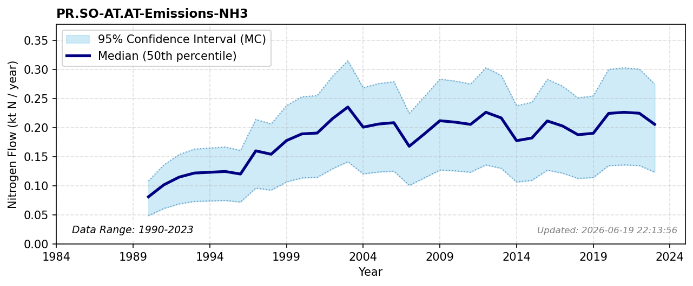

# NH3 Emissions (Solid Waste)

### Flow Description
**PR.SO-AT.AT-Emissions-NH3**: We have used data from CLRTAP Inventory Submissions, using the categories given in Table 48 and 31 (emissions from category 1A1 Energy industries are all assigned to the EF pool). Dynamics of atmospheric deposition and chemically reduced forms are supported by (Ackerman, 2019).

### References

* Ackerman, Daniel and Millet, Dylan B. and Chen, Xin (2019). *Global {Estimates} of {Inorganic} {Nitrogen} {Deposition} {Across} {Four} {Decades*. Global Biogeochemical Cycles. [https://onlinelibrary.wiley.com/doi/abs/10.1029/2018GB005990](https://onlinelibrary.wiley.com/doi/abs/10.1029/2018GB005990)
