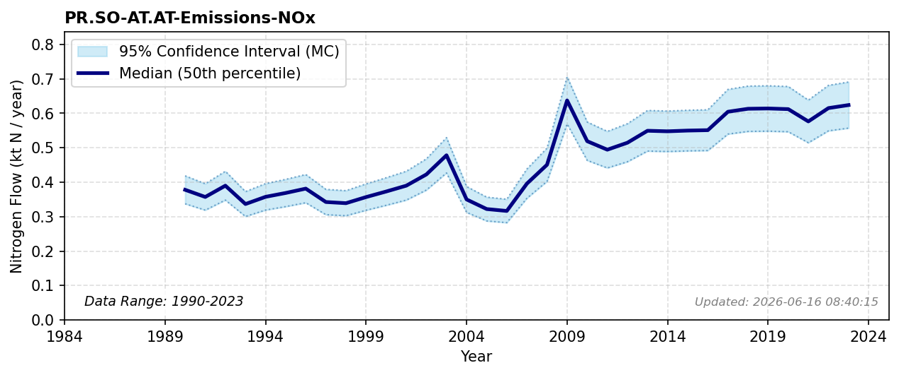

# NOx Emissions (Solid Waste)

### Flow Description
**PR.SO-AT.AT-Emissions-NOx**: We have used data from CLRTAP Inventory Submissions, using the categories given in Table 48 and 31 (emissions from category 1A1 Energy industries are all assigned to the EF pool). General atmospheric pathways of combustion emissions follow \\citep{fowler_global_2013}.

### References


