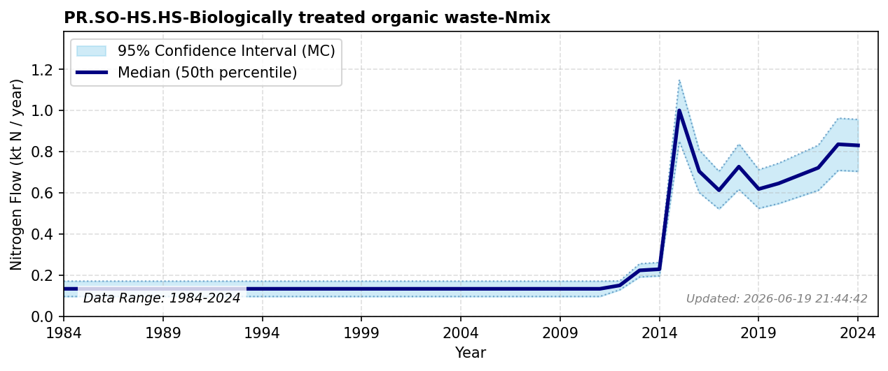

# Biologically treated organic waste to HS

### Flow Description
**PR.SO-HS.HS-Biologically treated organic waste-Nmix** includes all forms of organic waste except sewage sludge that is organically treated and used in agricultural soils. Biological treatment of organic waste includes both composting and biogas production, but in Norway, most of the waste composted in the municipal waste sector is used on the private sector, not in agriculture.\n\nSSB statistics on composted organic waste also includes some composted wastewater sludge, but there is no exact statistics on the amount. Opportunities and limitations regarding the agronomic use of human excreta and urban compost are reviewed in ({starck_fate_2023)} and ({kaltenegger_urban_2023)}.\n\nFrom 2018, we use data on the disposal of biologically produced waste from SSB table 12818 assuming a typical N content of compost, although a smaller fraction is also biogas digestate.\n\nFor 2012-2017, we use data on composted organic waste from SSB table 10513 “Avfallsregnskap for Norge (1 000 tonn) and scale the nitrogen value in 2018 for consistency.\n\nThere are no official data prior to 2012, but we know that there was organic waste composted and used in the private sector. In lack of other data we extrapolate the 2012 value back to 1990.

### References

* Missing reference data for key: `{kaltenegger_urban_2023`
* Missing reference data for key: `{starck_fate_2023`
